# TEL200_Ch2

Source PDF: TEL200_Ch2.pdf

## Page 1

### Images

#### Image 1 (Page 1)

---

## Page 2

TEL200 – Introduction to Robotics
David A. Anisi
Chapter 2: Representing position and orientation

---

## Page 3

ABB Fanta Challenge – What is needed?

### Images

#### Image 1 (Page 3)

---

## Page 4

• Know position and orientation (Pose) 
• Coordinate systems and representations
• Not only in 2D & 3D but also in joint- or configuration space
• Not only now but also as a function of time: Describe motion & time 
• Time varying pose, paths, trajectories
• Accelerating bodies and coordinate systems
• Dynamics of rigid, mechanical bodies
• Creating smooth paths and trajectories 
• Kinematic modelling & control of robot (arm) 
ABB Fanta Challenge – What is needed?
Ch. 2
Ch. 3
Ch. 7-8

---

## Page 5

Outline
• Ch. 2.1 Foundations 
• Ch. 2.2: Working in Two Dimensions (2D)
• Ch 2.3: Working in Three Dimensions (3D)
• Ch 2.4.9 Configuration space
2

### Images

#### Image 1 (Page 5)

---

## Page 6

Introduction
• A point P in space is a familiar concept from
mathematics and can be described by a
coordinate vector (Fig. a.)
• If we attach a coordinate frame to an object,
as shown in Fig. b, we can describe every
point within the object as a constant vector
with respect to that frame.
• What is the main benefit of this?
• Now we can describe the position and
orientation1 – the pose – of that coordinate
frame {𝐵} with
respect
to
the
reference
coordinate frame {0} as 𝜉𝐵.
2
1 Attitude is an alternative nomenclature for Orientation

### Images

#### Image 1 (Page 6)
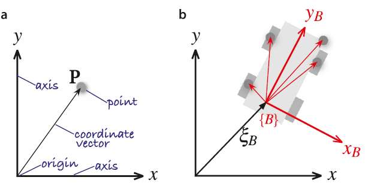

---

## Page 7

Relative pose
• Blue and red objects have different pose: 
position and orientation
• Rigid motion (no change in shape) 
consisting of translation and rotation
• Motion, 𝜉
∗  is always defined with respect 
to an initial pose.
Rigid motion in 2D (a) and 3D (b)
* Pronounced ksi

### Images

#### Image 1 (Page 7)
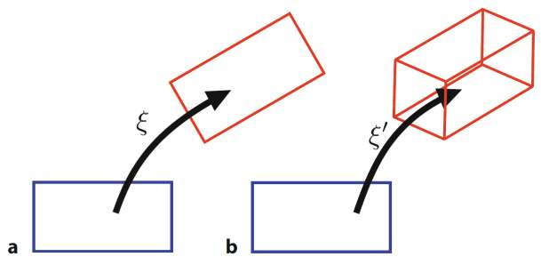

---

## Page 8

Relative pose
• Explicitly indicating start- (x) and end-
pose (y ):
• Motion composition: 
– is not commutative
– has an inverse or opposite motion
Introducing: 
We can write: 
𝑥𝜉𝑦

### Images

#### Image 1 (Page 8)
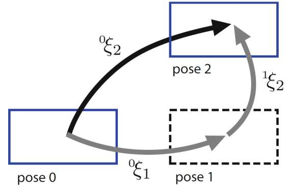

#### Image 2 (Page 8)
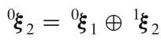

#### Image 3 (Page 8)
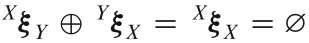

#### Image 4 (Page 8)
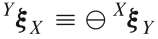

#### Image 5 (Page 8)
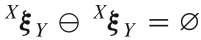

---

## Page 9

Relative pose
• The point P can be described with respect to either
coordinate frame by the vectors 𝐴𝑝
or 𝐵𝑝
respectively
• AξΒ : The relative pose of {B} to {A}
• Two interpretations for AξΒ:
– Picking up A and transforming it with AξΒ leaves A in
B’s place
– Let 𝐵𝑝
be the coordinates of p in {B}. Transforming
𝐵𝑝
with AξΒ gives coordinates of p in A, denoted 𝐴𝑝
2

### Images

#### Image 1 (Page 9)
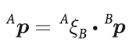

#### Image 2 (Page 9)
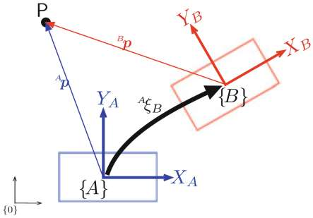

---

## Page 10

Relative pose
• An important characteristic of relative poses is that
they can be composed or compounded.
• The ⊕operator denotes compounding of relative poses
• Cancel out intermediate subscripts and superscripts
• The point P can e.g., be described by
• Q: How is this relevant and important for robotics?
2

### Images

#### Image 1 (Page 10)
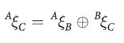

#### Image 2 (Page 10)
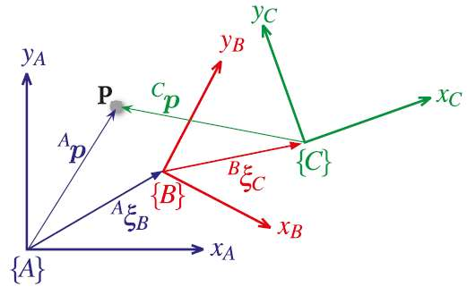

#### Image 3 (Page 10)
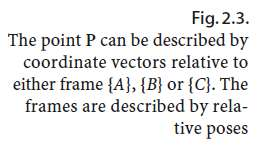

#### Image 4 (Page 10)
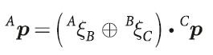

#### Image 5 (Page 10)
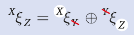

---

## Page 11

Examples of robot coordinate frames in robotics

### Images

#### Image 1 (Page 11)
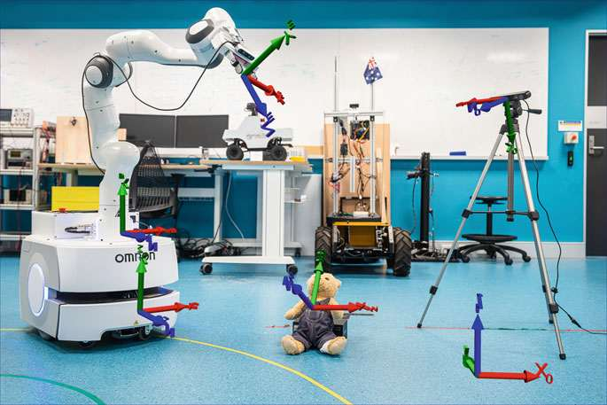

---

## Page 12

Introduction
• Figure 2.4 shows a 3-dimensional example in a
graphical form where we have attached 3D
coordinate frames to the various entities and
indicated some relative poses.
• Q: What is the pose of the robot relative to the
fixed camera?
2

### Images

#### Image 1 (Page 12)

#### Image 2 (Page 12)

---

## Page 13

Introduction
• Recalling that we can compose relative poses
using the ⊕operator we can write some spatial
relationships:
2
[formula text unreadable from PDF encoding; see source PDF/image]
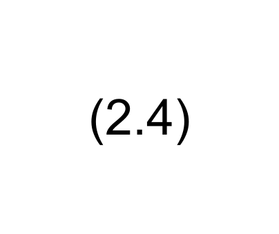

### Images

#### Image 1 (Page 13)

#### Image 2 (Page 13)

#### Image 3 (Page 13)
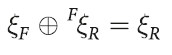

#### Image 4 (Page 13)

#### Image 5 (Page 13)

#### Image 6 (Page 13)

---

## Page 14

Introduction
• Recalling that we can compose relative poses
using the ⊕operator we can write some spatial
relationships:
2
[formula text unreadable from PDF encoding; see source PDF/image]
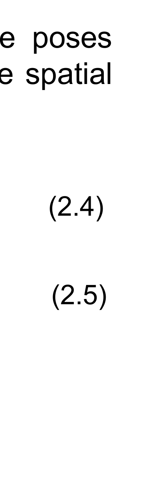

### Images

#### Image 1 (Page 14)
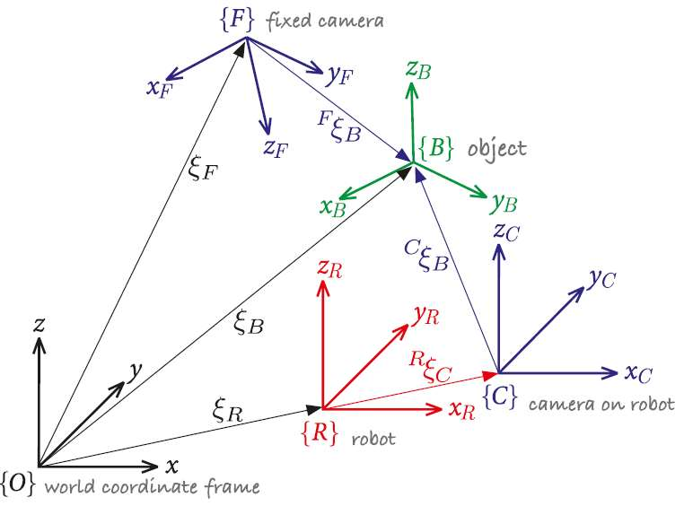

#### Image 2 (Page 14)
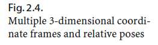

#### Image 3 (Page 14)
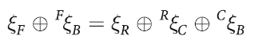

#### Image 4 (Page 14)

#### Image 5 (Page 14)

#### Image 6 (Page 14)

#### Image 7 (Page 14)

#### Image 8 (Page 14)

#### Image 9 (Page 14)

---

## Page 15

Introduction - Remark
• Algebraic rules for poses and relative poses
where 0 represents a zero relative pose. 
• Inverse of a pose: 
• Relative pose composition 
2
(R.1)
(R.3)
(R.4)
(R.2)

### Images

#### Image 1 (Page 15)
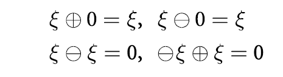

#### Image 2 (Page 15)
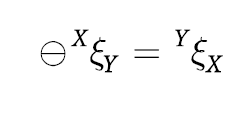

#### Image 3 (Page 15)
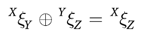

---

## Page 16

Introduction - Remark
• It is important to note that the algebraic rules for poses are different to normal 
algebra and that composition is not commutative
except when
2
(R.5)

### Images

#### Image 1 (Page 16)
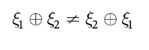

#### Image 2 (Page 16)
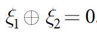

---

## Page 17

Introduction
• Q: What is the pose of the robot relative to the
fixed camera?
2
[formula text unreadable from PDF encoding; see source PDF/image]

### Images

#### Image 1 (Page 17)

#### Image 2 (Page 17)

#### Image 3 (Page 17)

#### Image 4 (Page 17)
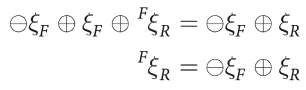

#### Image 5 (Page 17)

#### Image 6 (Page 17)

#### Image 7 (Page 17)

#### Image 8 (Page 17)

---

## Page 18

Foundations - Recap
1) A point is described by a coordinate vector that represents its displacement from the 
origin of a reference coordinate system;
2) A set of points representing a rigid object can be described by a single coordinate 
frame, and the constituent points, described by displacements from it
3) The position and orientation of an object’s coordinate frame is referred to as its pose;
4) A relative pose describes the pose of one coordinate frame with respect to another and 
is denoted by an algebraic variable ξ;
5) A coordinate vector describing a point can be represented with respect to a different 
coordinate frame by applying the relative pose to the vector;
6) We can perform algebraic manipulation of expressions written in terms of relative poses 
and the operators ⊕and ⊖ and the concept of a null motion Ø;
2

---

## Page 19

Summary - A key takeaway about pose
2

### Images

#### Image 1 (Page 19)
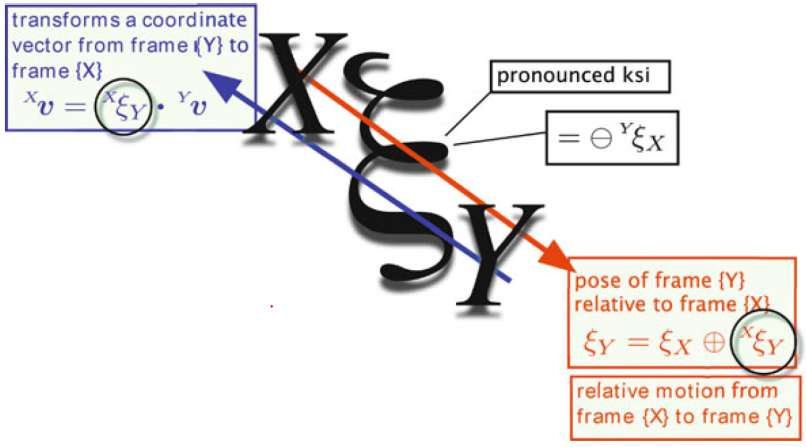

---

## Page 20

Working in Two Dimensions (2D)
• A point P is represented by its 𝑥- and 𝑦-
coordinates (x, y) and unit-vectors parallel 
to the axes are denoted ෝ𝒙and ෝ𝒚.
2
[formula text unreadable from PDF encoding; see source PDF/image]
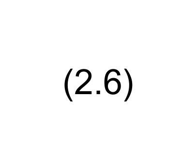

### Images

#### Image 1 (Page 20)
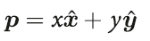

#### Image 2 (Page 20)
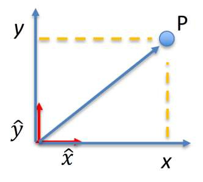

---

## Page 21

Working in Two Dimensions (2D)
• Figure 2.6 shows that the origin of {𝐵} has been
$$
displaced by the vector 𝑡= (𝑥, 𝑦)
$$
and then
rotated counter-clockwise by an angle 𝜃.
• We can use ΑξΒ ∼(x, y , θ) to represent this
relative pose
• But is this a convenient representation?
(x1, y1,θ1) ⊕(x2, y2,θ2)
• We decompose the problem into two parts: 
Rotation and Translation
2

### Images

#### Image 1 (Page 21)
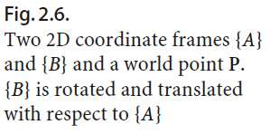

#### Image 2 (Page 21)
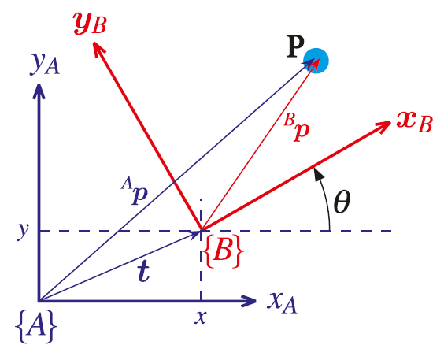

#### Image 3 (Page 21)

#### Image 4 (Page 21)

---

## Page 22

Rotation in Two Dimensions (2D)
• Frame {𝐴} is completely described by ොxA and ොyA
• Frame {B} is completely described by ොxB and ොyB
2
Fig. 2.10 Rotated coordinate frames

### Images

#### Image 1 (Page 22)
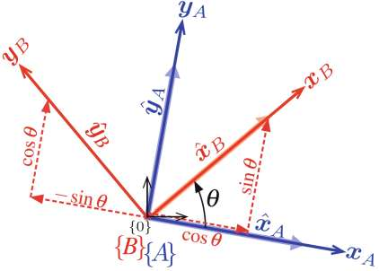

#### Image 2 (Page 22)
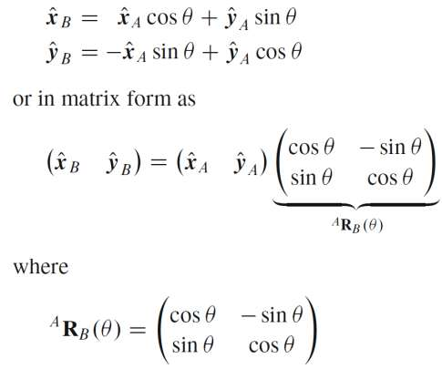

---

## Page 23

Rotation in Two Dimensions (2D)
• Matrix ARB(θ) is known as a rotation matrix and
describes how points are transformed from frame
{𝐵} to frame {A} when the frame is rotated  deg.
• ARB is orthogonal with the determinant equal to 1
$$
and R-1 = RT while R(-θ)=R(θ)Τ
$$
• The matrix-vector product Rv preserves the 
length and relative orientation of vectors v
• It is a member of the Special Orthogonal (SO) 
group of dimension 2 which we write as
2
Fig. 2.10 Rotated coordinate frames

### Images

#### Image 1 (Page 23)

#### Image 2 (Page 23)
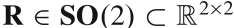

---

## Page 24

2D Rotation Matrix - Properties
• Using a four-element matrix to describe a scalar; rotation angle! 
• The properties pose three constraints
– Both columns has unit magnitude
– The columns are orthogonal
• Non-minimal representation
– Increased representation complexity
– BUT: easy to combine and calculate using normal matrix algebra

---

## Page 25

Working in Two Dimensions (2D)
• Translation is simple vectorial addition 
since {A} and {A’} are parallel

### Images

#### Image 1 (Page 25)

#### Image 2 (Page 25)
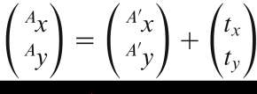

#### Image 3 (Page 25)
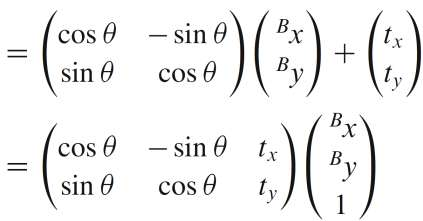

---

## Page 26

Working in Two Dimensions (2D)
• Or more compactly
$$
where AtB = (tx, ty) is the translation and  ARB (θ)
$$
is the orientation is of the frame {B} w.r.t. {A}
• Note that ARB = A’RB since the axes of frames 
{A} and {A’} are parallel

### Images

#### Image 1 (Page 26)
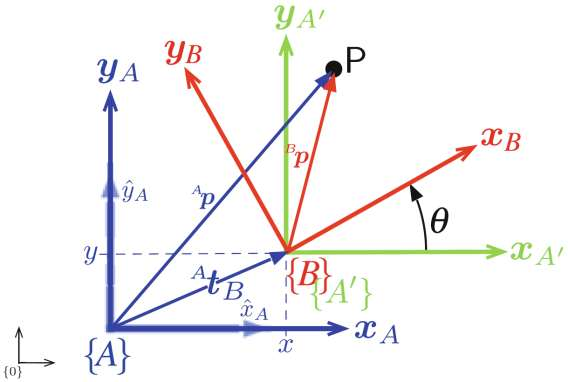

#### Image 2 (Page 26)
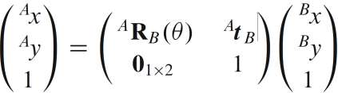

---

## Page 27

• The coordinate vectors for point P are now 
expressed in homogeneous form and we write
• ATB represents both translation and orientation or 
relative pose and is referred to as a 
homogeneous transformation
• It has very specific structure and belongs to the 
Special Euclidean group of dimension 2:
Working in Two Dimensions (2D)
Rotation
Translation
Scaling

### Images

#### Image 1 (Page 27)
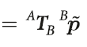

#### Image 2 (Page 27)
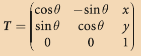

#### Image 3 (Page 27)
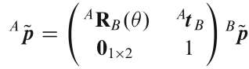

#### Image 4 (Page 27)
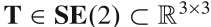

---

## Page 28

Working in Two Dimensions (2D)

### Images

#### Image 1 (Page 28)
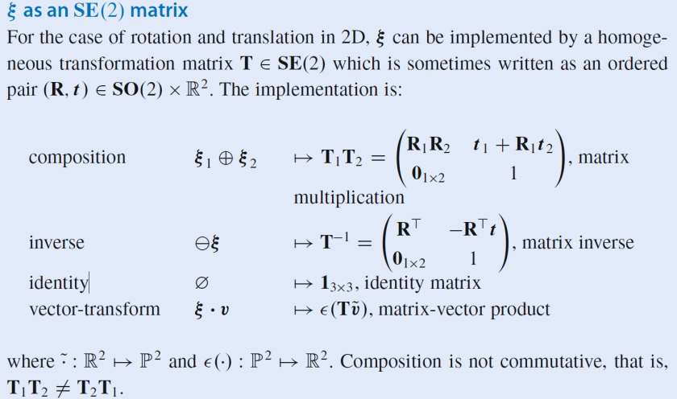

---

## Page 29

Working in Three Dimensions (3D)
• The 3-dimensional case is an extension of the 2-dimensional case
• The direction of the 𝑧-axis obeys the right-hand rule and forms a
right-handed coordinate frame.
• Unit vectors parallel to the axes are denoted ෝ𝒙, ෝ𝒚and ො𝒛
such that
• A point P is represented by its 𝑥-, 𝑦- and 𝑧-coordinates (𝑥, 𝑦, 𝑧) or as
a bound vector
2
(2.20)
go.sn.pub/ATBZR0

### Images

#### Image 1 (Page 29)
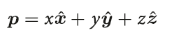

#### Image 2 (Page 29)
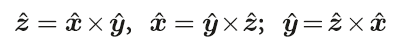

#### Image 3 (Page 29)
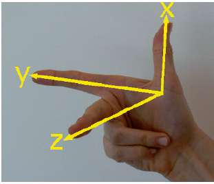

#### Image 4 (Page 29)

---

## Page 30

Working in Three Dimensions (3D)
Rotation About a Vector:
• Wrap your right hand around the vector 
with your thumb (your x-finger) in the 
direction of the arrow. The curl of your 
fingers indicates the direction of 
increasing angle.

### Images

#### Image 1 (Page 30)
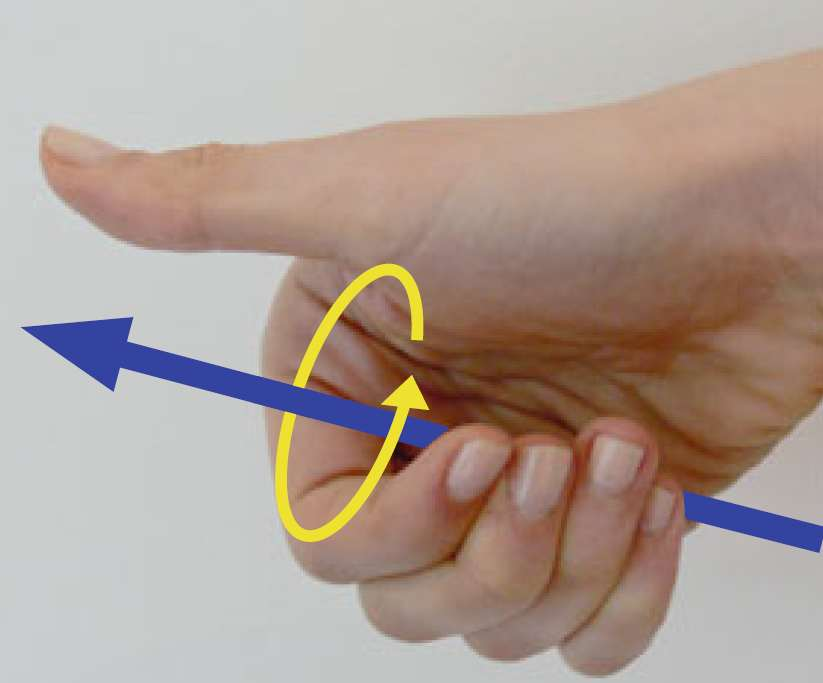

---

## Page 31

Orientation in 3-Dimensions
• Rotation in 3D is not commutative
• The order in which rotations are
applied decides the result
2
𝑅𝑥
𝜋
2  𝑅𝑦
𝜋
2 ≠𝑅𝑦
𝜋
2  𝑅𝑥
𝜋
2

### Images

#### Image 1 (Page 31)
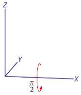

#### Image 2 (Page 31)

#### Image 3 (Page 31)

#### Image 4 (Page 31)

#### Image 5 (Page 31)

#### Image 6 (Page 31)

---

## Page 32

Working in Three Dimensions (3D)
• Figure shows a red coordinate frame {𝐵} that we wish
to describe with respect to the blue reference frame {𝐴}.
• We can see that the origin of {𝐵} has been displaced by 
the vector
and then rotated in some complex fashion by
Euler’s rotation theorem states that any rotation
can be considered as a sequence of 3 rotations
such that no two successive rotations are about the
same axis.
2

### Images

#### Image 1 (Page 32)

#### Image 2 (Page 32)

#### Image 3 (Page 32)

---

## Page 33

Orthonormal Rotation Matrix
• We can represent the orientation of a coordinate frame by its unit vectors expressed in 
terms of the reference coordinate frame.
• Each unit vector has three elements, and they form the columns of a 3 × 3 orthonormal 
matrix
which transforms the description of a vector defined with respect to frame {𝐵} to a vector 
with respect to {𝐴}.
2
(2.21)

### Images

#### Image 1 (Page 33)

#### Image 2 (Page 33)

---

## Page 34

Orthonormal Rotation Matrix
• The orthonormal rotation matrices for rotation of 𝜃about the 𝑥-, 𝑦- and 𝑧-axes are
2

### Images

#### Image 1 (Page 34)

#### Image 2 (Page 34)

#### Image 3 (Page 34)

---

## Page 35

Orthonormal Rotation Matrix

### Images

#### Image 1 (Page 35)

---

## Page 36

Three-Angle Representation
• Euler’s rotation theorem requires successive rotation about three axes such that no
two successive rotations are about the same axis.
• “Euler angles” is an ambiguous term
• The ZYZ angle sequence
is commonly used in aeronautics and mechanical dynamics
• The Euler angles are the 3-vector:
2

### Images

#### Image 1 (Page 36)

#### Image 2 (Page 36)

#### Image 3 (Page 36)

#### Image 4 (Page 36)

---

## Page 37

Three-Angle Representation
• There are a total of twelve unique rotation sequences. 
– XYX, XZX, YXY, YZY, ZXZ, ZYZ (rotation about one particular axis)
– XYZ, XZY, YZX, YXZ, ZXY, ZYX (roation about all three axes)
• The particular angle sequence is convention within a particular technology field
Roll-pitch-yaw angles are common for describing vehicle attitudes,
e.g., aircrafts, ships and cars
• There are two different roll-pitch-yaw sequences in common use: 
– ZYX for mobile robots and XYZ for robot manipulators
• The ZYX angle sequence 
2

### Images

#### Image 1 (Page 37)

#### Image 2 (Page 37)

---

## Page 38

Three-Angle Representation
• When describing the attitude of a robot gripper the
convention is that the 𝑧-axis points forward and the 𝑥-
axis is either up or down.
• This leads to the XYZ angle sequence
• A
fundamental
problem
with
all
the
three-angle
representations is singularity. This is also known as
gimbal lock.
• This occurs when the rotational axis of the middle
term in the sequence becomes parallel to the rotation
axis of the first or third term – effectively loosing 1
Degree of Freedom (DoF)
2
(2.24)

### Images

#### Image 1 (Page 38)

#### Image 2 (Page 38)

#### Image 3 (Page 38)

#### Image 4 (Page 38)

---

## Page 39

Quarternions: non-minimal representation
• Extension of complex numbers
 
q = s + v = s + v1i + v2j + v3k
• Where s ℝ, v  ℝ3 and 
 
i2 = j2 = k2 = ijk = -1
• Denoted q = s < v1 ,v2 ,v3 >
• Multiplication (Hamilton Product):
q1.q2 = s1s2 - v1.v2 < s1v2 + s2v1 + v1 x v2>
• Quaternions are non-commutiative
• Rotations are represented by non-
singular unit quaternions

### Images

#### Image 1 (Page 39)

#### Image 2 (Page 39)

---

## Page 40

Quarternions: non-minimal representation

### Images

#### Image 1 (Page 40)

---

## Page 41

Pose in 3-Dimensions
• The derivation for the homogeneous transformation matrix is given by:
where
A𝒕B ∈ℝ3 is a vector defining the origin of frame {B} with respect to frame
{𝐴}, and A𝑹B ∈𝑆𝑂(3) is the 3 × 3 orthonormal matrix which describes the orientation of
the axes of frame {𝐵} with respect to frame {𝐴}
2

### Images

#### Image 1 (Page 41)

---

## Page 42

Pose in 3-Dimensions
• If points are represented by homogeneous coordinate vectors, then
Where ATB is a 4 × 4 homogeneous transformation matrix
• T belongs to the Special Euclidean group of dim 3: T SE(3) ℝ4x4
• The 4 × 4 homogeneous transformation is very commonly used in robotics,
computer graphics and computer vision.
2
(2.36)

### Images

#### Image 1 (Page 42)

---

## Page 43

Pose in 3-Dimensions: Properties
2

### Images

#### Image 1 (Page 43)

---

## Page 44

• So far, we have considered the pose of objects; position & orientation in 2D/3D
• An alternative way of thinking about this comes from classical mechanics and is referred to as 
the configuration of a system.
• The configuration is the smallest set of parameters, called generalized coordinates, that are 
required to fully describe the position of every particle in the system.
• The number of independent generalized coordinates, N, is known as the number of Degrees 
of Freedom (DoF) of the system
• Any configuration of the system is represented by a point in its N-dimensional configuration 
$$
space, or C-space, denoted by C and q ∈ C. We have dim(C) = N.
$$
• Over/under actuated: number of control inputs are larger/smaller than N. 
• All under-actuated systems are also non-holonomic (will get back to this in Ch. 4)
Configuration space (Ch. 2.4.9)

---

## Page 45

48
Mobile Robots – Locomotion and configuration space examples
Fully actuated      Under-actuated          Under-actuated
Under-actuated
Under-actuated        Under-actuated
Holonomic
Non-holonomic           Non-holonomic
Non-holonomic          Non-holonomic
Non-holonomic
Train 
Hover 
Helicopter 
Fixed-wing aircraft           Quadrotor 
Car

### Images

#### Image 1 (Page 45)

---

## Page 46

Configuration space of industrial robots
• Most traditional industrial robots have 
6-axis (DoF) and 6 actuators
$$
q = (q1, q2, q3, q4, q5, q6)
$$
• The C-space and task-space have the 
same dimension (holonomic system)

### Images

#### Image 1 (Page 46)

---

## Page 47

Configuration space of ABB YuMi
• ABB YuMi has 7 axis (over-actuated). This to improve reachability & manipulability
• Still, singularities exist as depicted in this video
Photo courtesy: ABB Robotics

### Images

#### Image 1 (Page 47)

---

## Page 48

Summary – some takes aways from Ch 2.
Lesson
1:
There
are
many
mathematical
objects
that
can
represent relative pose.
• No right or wrong; all have their pros and cons; but all 3 angular
descriptions have singularities
Lesson 2: coordinate frame are your friend, embrace them!
• Start by assigning coordinate frames to all objects of interest
Lesson 3: robots can be described in both task space (2D/3D) and
configuration/joint space. We will utilize this in the upcoming lab!
2

### Images

#### Image 1 (Page 48)

---

## Page 49

Online videos: QUT Robot Academy

### Images

#### Image 1 (Page 49)

---

## Page 50

Thank you for your attention !

---
