# TEL200_Ch3

Source PDF: TEL200_Ch3.pdf

## Page 1

### Images

#### Image 1 (Page 1)

---

## Page 2

TEL200 – Introduction to Robotics
David A. Anisi
Chapter 3: Time and Motion

---

## Page 3

• Pose: the position and orientation ξ of an object (Ch 2.)
– Can be used for defining start and end poses, A and B.
• Path: a varying pose ξ(s), for some parameter s [s0, ST]
–Takes us from A to B but has no notion of time
• Trajectory: a path with specified timing, ξ(s(t)), for t [0, T]
–Defines the time-evolution, or speed along the path from A to B 
• Note: The notions of path and trajectory can also be generalized to motion in the 
configuration space or joint space of a robot.
Some basic notions

---

## Page 4

Time-Varying Pose
• How to describe the rate of change of pose which has both a translational and
rotational velocity component ?
• The translational velocity is straightforward: it is the rate of change of the position of
the origin of the coordinate frame.
• Rotational velocity is a little more complex.
2

---

## Page 5

Derivative of Pose
• There are many ways to represent the orientation matrix of a coordinate frame but most
convenient for present purposes is the exponential form (see Sect. 2.3.1.6):
where:
denotes rotation axis with respect to frame {𝐴}
𝜃(𝑡)
is the rotational angle,
· ×
is a skew-symmetric matrix.
2

### Images

#### Image 1 (Page 5)
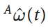

#### Image 2 (Page 5)
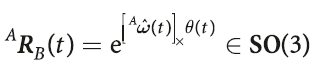

---

## Page 6

Derivative of Pose
• At an instant in time 𝑡we will assume that the axis has a fixed direction, and the frame is
rotating around the axis.
• The derivative with respect to time is
which we write succinctly as
where
is the angular velocity of frame {B} w.r.t. frame {𝐴}.
2
[formula text unreadable from PDF encoding; see source PDF/image]
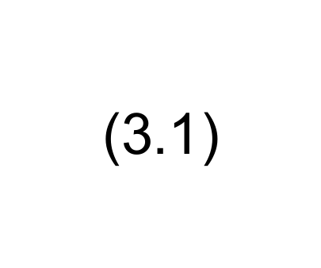

### Images

#### Image 1 (Page 6)
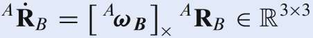

#### Image 2 (Page 6)
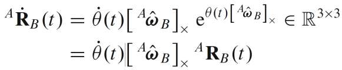

#### Image 3 (Page 6)
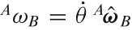

---

## Page 7

Derivative of Pose
• Angular velocity:
2

### Images

#### Image 1 (Page 7)
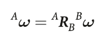

#### Image 2 (Page 7)
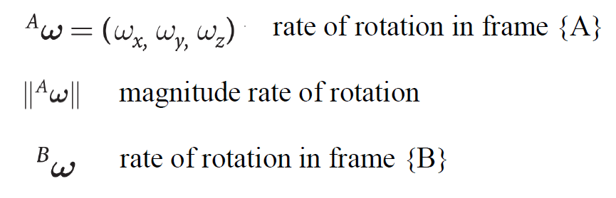

---

## Page 8

Derivative of Pose
• The derivative of pose can be determined by expressing pose as a homogeneous
transformation matrix
and taking the derivative with respect to time and substituting Eq. (3.1) gives
2
[formula text unreadable from PDF encoding; see source PDF/image]
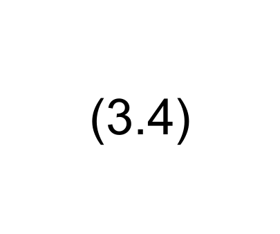

### Images

#### Image 1 (Page 8)
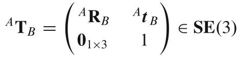

#### Image 2 (Page 8)
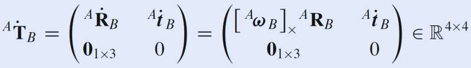

---

## Page 9

Derivative of Pose
• The rate of change can be described in terms of the current orientation
and
two velocities:
– The linear or translational velocity
is the velocity of {𝐵} w.r.t. {𝐴};
– The angular velocity           we have already introduced ;
• We can combine these two velocity vectors to create the spatial velocity vector
which is the instantaneous velocity of frame {𝐵} with respect to {𝐴}.
2

### Images

#### Image 1 (Page 9)
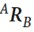

#### Image 2 (Page 9)
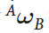

#### Image 3 (Page 9)
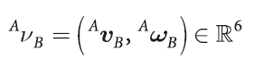

#### Image 4 (Page 9)
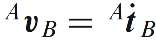

---

## Page 10

Transforming Spatial Velocities
• The
velocity
of
a
moving
body
can
be
expressed with respect to a world reference
frame {𝐴} or the moving body frame {𝐵}
• Spatial velocities are linearly related by:
where
and
is a Jacobian 
or interaction matrix.
2
[formula text unreadable from PDF encoding; see source PDF/image]
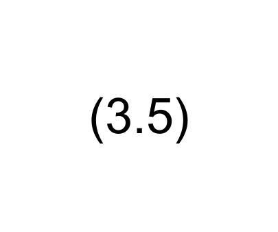

### Images

#### Image 1 (Page 10)

#### Image 2 (Page 10)
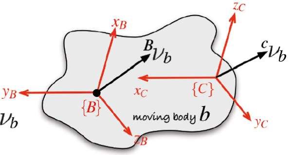

#### Image 3 (Page 10)
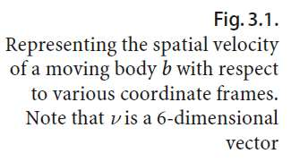

#### Image 4 (Page 10)

#### Image 5 (Page 10)

#### Image 6 (Page 10)

---

## Page 11

Transforming Spatial Velocities
• For the case where frame {C} is also on the
moving body the transformation becomes
and involves the adjoint matrix of the relative
pose.
2

### Images

#### Image 1 (Page 11)
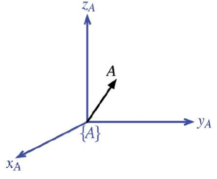

#### Image 2 (Page 11)

#### Image 3 (Page 11)

#### Image 4 (Page 11)
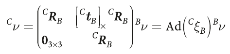

---

## Page 12

Dynamics of Moving Bodies
• For translational motion Newton’s second law describes, in the inertial frame, the acceleration
of a particle with position 𝑥and mass 𝑚
due to the applied force 0𝑓B.
2
(3.13)

### Images

#### Image 1 (Page 12)

---

## Page 13

Dynamics of Moving Bodies
• For translational motion Newton’s second law describes, in the inertial frame, the acceleration
of a particle with position 𝑥and mass 𝑚
due to the applied force 0𝑓B.
• Rotational motion in SO(3) is described by Euler’s equations of motion which relates the
angular acceleration of the body in the body frame
to the applied torque or moment B𝜏B and a positive-definite rotational inertia matrix
2
(3.14)
(3.13)

### Images

#### Image 1 (Page 13)
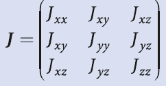

#### Image 2 (Page 13)
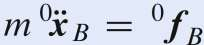

#### Image 3 (Page 13)
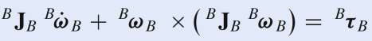

#### Image 4 (Page 13)
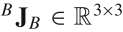

---

## Page 14

Transforming Forces and Torques
• The spatial velocity is a vector quantity that represents translational and rotational velocity
• Similarly, we can combine translational force and rotational torque (or moment) into a 6-vector
that is called a wrench
• Two wrenchs, A𝒘 and B𝒘 are defined with respect to the coordinate frame {A} and {B}
respectively and both are applied at the origin of the frames.
• They are equivalent if they cause the same motion on the body
2

### Images

#### Image 1 (Page 14)
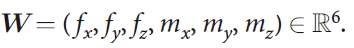

---

## Page 15

Transforming Forces and Torques
• The wrenches, A𝒘 and B𝒘 are related by
which is similar to the spatial velocity transform of Eq. (3.5) but uses the transpose of the 
adjoint of the inverse relative pose.
2
(3.15)

### Images

#### Image 1 (Page 15)
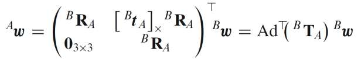

---

## Page 16

Inertial Reference Frame
• Inertial Reference Frame is a reference frame that is not accelerating or rotating.
• If the reference frame {𝐵} is rotating with angular velocity ω about its origin, then Newton’s
second law Eq. (3.13) becomes:
- Centripetal acceleration always acts inward toward the origin;
- If the point is moving, then Coriolis acceleration will be normal to its velocity;
- If rotational velocity is time varying, then Euler acceleration will be normal to the position vector.
- In robotics, «world coordinate frame» typically constitutes an Inertial Reference Frame
2

### Images

#### Image 1 (Page 16)
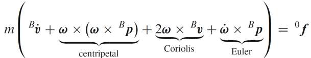

---

## Page 17

Creating Time-varying Pose
• In robotics we often need to generate a
time-varying pose (i.e., a path) that moves
smoothly in translation and rotation.
2
Path representation Γ
A
B

### Images

#### Image 1 (Page 17)

#### Image 2 (Page 17)

#### Image 3 (Page 17)

#### Image 4 (Page 17)
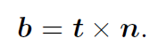

---

## Page 18

Creating Time-varying Pose
• In robotics we often need to generate a
time-varying pose (i.e., a path) that moves
smoothly in translation and rotation.
• A path is a spatial construct – a locus in
space that leads from an initial pose A to a
final pose B.
2
Path representation Γ
A
B

### Images

#### Image 1 (Page 18)

#### Image 2 (Page 18)

#### Image 3 (Page 18)

#### Image 4 (Page 18)

---

## Page 19

Creating Time-varying Pose
• In robotics we often need to generate a
time-varying pose (i.e., a path) that moves
smoothly in translation and rotation.
• A path is a spatial construct – a locus in
space that leads from an initial pose A to a
final pose B.
• A trajectory is a path with specified timing.
For example, there is a path from A to B,
but there is a trajectory from A to B in time
Δ𝑡= 10 𝑠or at velocity v = 2𝑚𝑠−1.
2
Path representation Γ
A
B

### Images

#### Image 1 (Page 19)
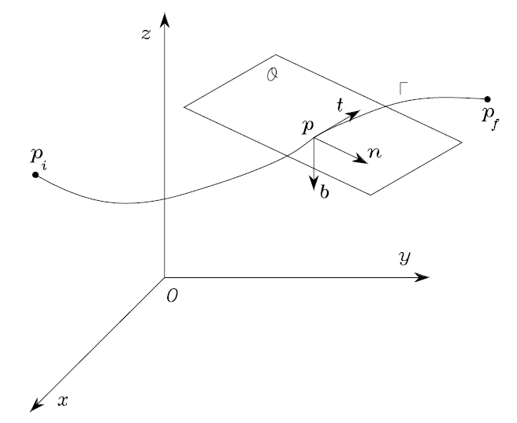

#### Image 2 (Page 19)

#### Image 3 (Page 19)

#### Image 4 (Page 19)

---

## Page 20

Creating Time-varying Pose
• An important characteristic of a trajectory is
that it is smooth – position and orientation
vary smoothly with time 𝑡.
• We start by discussing how to generate
smooth trajectories in one dimension.
• Then, we extend trajectory generation to
the multi-dimensional case and next to
piecewise-linear
trajectories
that
visit
a
number
of
intermediate
points
without
stopping.
2
Path representation Γ

### Images

#### Image 1 (Page 20)

#### Image 2 (Page 20)
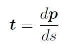

#### Image 3 (Page 20)
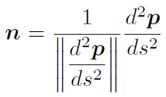

#### Image 4 (Page 20)

---

## Page 21

Smooth One-Dimensional Trajectories
• Smoothness in this context means that its first few temporal derivatives are
continuous.
• Examples: 
     Sinusoid 
 
     Gaussian  
 
Polynomial

### Images

#### Image 1 (Page 21)
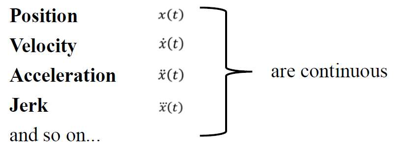

#### Image 2 (Page 21)
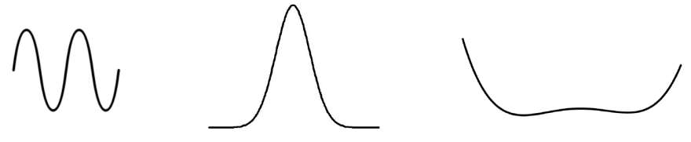

---

## Page 22

Smooth One-Dimensional Trajectories
• Consider a scalar function of time 𝑞𝑡,
where time 𝑡∈[0, 𝑇].
• Important characteristics of this function are
that its initial and final value are specified
and that it is smooth.
2

### Images

#### Image 1 (Page 22)
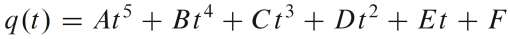

---

## Page 23

Smooth One-Dimensional Trajectories
• Consider a scalar function of time 𝑞𝑡,
where time 𝑡∈[0, 𝑇].
• Important characteristics of this function are
that its initial and final value are specified
and that it is smooth.
• Smoothness in this context means that its
first few temporal derivatives (i.e.,
ሶ𝑞and
ሷ𝑞)
are continuous.
2

### Images

#### Image 1 (Page 23)

#### Image 2 (Page 23)

---

## Page 24

Smooth One-Dimensional Trajectories
• Consider a scalar function of time 𝑞𝑡,
where time 𝑡∈[0, 𝑇].
• Important characteristics of this function are
that its initial and final value are specified
and that it is smooth.
• Smoothness in this context means that its
first few temporal derivatives (i.e.,
ሶ𝑞and
ሷ𝑞)
are continuous.
• Typically, velocity and acceleration are
required to be continuous and sometimes
also the derivative of acceleration or jerk.
2

### Images

#### Image 1 (Page 24)

#### Image 2 (Page 24)
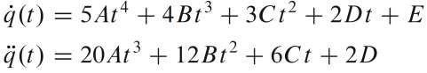

#### Image 3 (Page 24)
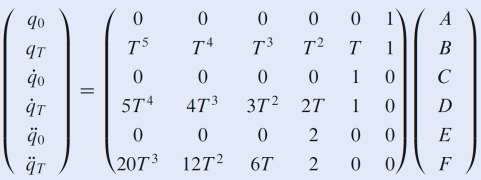

---

## Page 25

Smooth One-Dimensional Trajectories
quintic (5th order) polynomial trajectory
$$
traj =quintic(q0,qF,M) is a scalar trajectory (Mx1) that varies smoothly
$$
from q0 to qF in M steps using a quintic (5th order) polynomial.
Position (traj.q), velocity (traj.qd), and acceleration (traj.qdd)
2

### Images

#### Image 1 (Page 25)
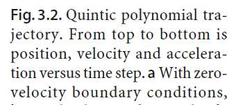

#### Image 2 (Page 25)
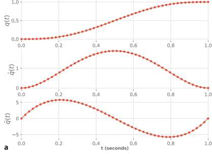

---

## Page 26

Smooth One-Dimensional Trajectories
trapezoidal Linear segment with parabolic blend
$$
traj=trapezoidal(q0,qF,M)is
$$
a
scalar
trajectory
(Mx1)
that
varies
smoothly from S0 to SF in M steps using a constant velocity segment and
parabolic blends (a trapezoidal path). It is continuous in position and velocity, but
not in acceleration.
2

### Images

#### Image 1 (Page 26)
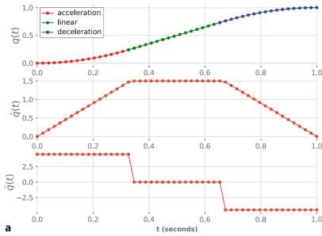

---

## Page 27

Multi-Dimensional Trajectories
2
• Most useful robots have more than one axis of motion and it is quite straightforward
to extend the smooth scalar trajectory to the vector case.
• In terms of configuration space, these axes of motion correspond to the dimensions
of the robot’s configuration space – to its Degrees of Freedom (DoFs).
Thorvald Robot 
ABB YuMi Robot
DJI Phantom 4

### Images

#### Image 1 (Page 27)
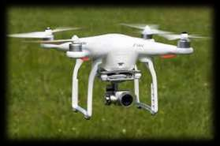

#### Image 2 (Page 27)
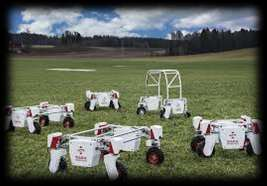

#### Image 3 (Page 27)
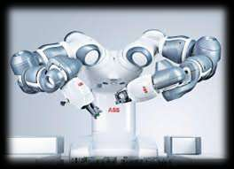

---

## Page 28

Multi-Dimensional Trajectories
2
• We represent the robot’s configuration as a vector 𝑞∈ℝ𝑛where 𝑛is the number
of degrees of freedom.
a.
Robot arm with 6-joints:
𝑞= (𝑞1, 𝑞2, 𝑞3, 𝑞4 , 𝑞5, 𝑞6)
b.
Wheeled mobile robot:
𝑞= 𝑥, 𝑦, 𝜃
c.
Aerial mobile robot:   
𝑞= 𝑥, 𝑦, 𝑧, 𝜃𝑟, 𝜃𝑝, 𝜃𝑦
• In all these cases we would require smooth multi-dimensional motion from an initial 
configuration vector 𝑞0 to a final configuration vector 𝑞𝑓.

---

## Page 29

Multi-Dimensional Trajectories
mtraj Multi-axis trajectory between two points
$$
[Q,QD,QDD]=mtraj(TFUNC,Q0,QF,M)is
$$
a
multi-axis
trajectory
(MxN)
varying from configuration Q0 (1xN) to QF (1xN) according to the scalar trajectory
function TFUNC in M steps.
The first argument (TFUNC) is a function that generates a smooth scalar
trajectory, e.g., trapezoidal or quintic
2

---

## Page 30

Multi-Segment Trajectories
• Need to move along a path trough one 
or more via-points without stopping:
– Obstacle avoidance
– Follow robot pose/targets through 
piecewise continuous trajectories
• Trajectory q defined by M via-points qk, 
k ∈ [0, M-1], i.e., M-1 motion segments
• Robot at rest at q0 and qM-1
• Moves through (or close to) other qi 
without stopping

### Images

#### Image 1 (Page 30)
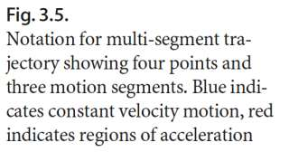

#### Image 2 (Page 30)
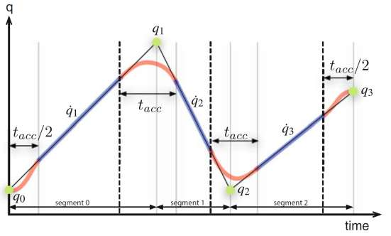

---

## Page 31

• Important, e.g. if we require the end effector of a robot to smoothly change from 
orientation ξ0 to ξ1 in S3
$$
• Want some function ξ(s) =σ (ξ0, ξ1, s) where s ∈[0, 1] which has the boundary conditions σ
$$
$$
(ξ0, ξ1, 0) = ξ0 and σ (ξ0, ξ1, 1) = ξ1 and where σ (ξ0, ξ1, s) varies smoothly for intermediate
$$
values of s.
• Linear interpolation of Rotation matrix ξ ∼R ∈ SO(3), should not be used as it typically 
result in not valid orthonormal matrix
• Instead, consider a representation ξ ∼Γ ∈𝕊1× 𝕊1×𝕊1 and use
Interpolation of Orientation in 3D

### Images

#### Image 1 (Page 31)
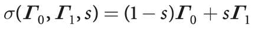

---

## Page 32

Wrapping up…
• There are many mathematical objects that can be used to represent pose and velocity
of a rigid body:
– Position: vector for 2D and 3D cases;
– Orientation: angle, rotation matrix, and unit-quaternion for 2D and 3D cases;
– Orientation and translation: homogeneous transformation matrix.
• 3D Matrices composition is non-commutative, i.e., the order in which relative poses
are multiplied is important:
– World (or fixed) frame: pre-multiplication;
– Body (or current) frame: post-multiplication.
5

---

## Page 33

Wrapping up…
• In robotics, we often need to generate a time-varying pose that moves
smoothly in translation and rotation; 
• A path is a spatial construct that leads from an initial pose 𝑞0 to a final pose 𝑞𝑓,
whereas a trajectory is a path with specified timing and velocity;
• Here, we have studied 3 smooth trajectory generation methods for one
dimension and multi-dimensional cases: quintic, trapezoidal, and mtraj;
• Indeed, quintic gives mean velocities far less than the maximum speed
while trapezoidal gives a trapezoidal velocity profile with non-smooth
accelerations.
• Multi-segment trajectories and interpolation of orientations are useful to
know about for the upcoming robot-lab
5

---

## Page 34

Thank you for your attention !

---
