# TEL200_Ch7

Source PDF: TEL200_Ch7.pdf

## Page 1

### Images

#### Image 1 (Page 1)

---

## Page 2

TEL200 – Introduction to Robotics
David A. Anisi
Chapter 7: Robot manipulator kinematics

---

## Page 3

TEL200 Introduction to Robotics
Change of schedule from next week:
• Project/lab:
Tuesdays 
14.15-18.00 
TF4-102
Thursdays
12.15-14.00
TF4-102
Fridays
8.15-10.00
TF4-102
Check time-edit for updated schedule!
2

---

## Page 4

Agenda
7.1 Forward Kinematics
7.2 Inverse Kinematics
7.3 Trajectories

### Images

#### Image 1 (Page 4)

#### Image 2 (Page 4)
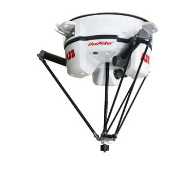

#### Image 3 (Page 4)

#### Image 4 (Page 4)
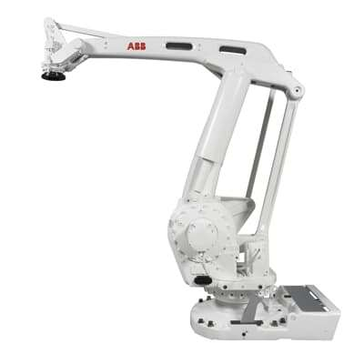

#### Image 5 (Page 4)
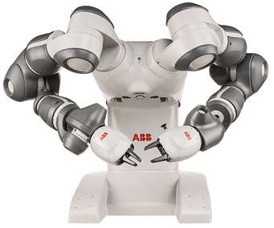

#### Image 6 (Page 4)

---

## Page 5

Kinematics
• From the Greek word for motion
• A branch of mechanics that studies the 
motion of a body, or system of bodies
• Concerned with positions (and angles) 
and velocities (translational and angular) 
• Not concerned with mass, forces or 
moments (that’s Dynamics, Ch. 9)

### Images

#### Image 1 (Page 5)
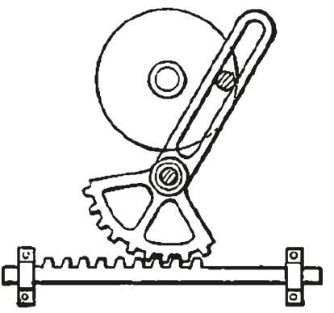

---

## Page 6

Kinematics
$$
The relationship and mapping between configuration (e.g., joint coordinates q = [q1, … , qN])
$$
$$
and end-effector pose (e.g., Cartesian: 𝝃= [x, y, z, Φ1, Φ2, Φ3])
$$
Forward kinematics
Backward kinematics
q  
 𝝃

---

## Page 7

Some robot manipulator terminology
• Base is the link of the manipulator which is 
usually connected to the ground/mobile unit
• Joint is a part of the robot body which 
allows controlled or free relative motion of 
two links. Joint qi connects Linki and Linki+1
• Link is the rigid part of the robot body 
(upper arm, forearm, etc.)
• End effecter is the link of the manipulator 
which is used to hold the tools (gripper, 
spray/welding gun, etc.)
Base
Shoulder
Upper arm
Elbow block
Forearm
End effector
q0
q3
q2
q1
q4
q5
Wrist

### Images

#### Image 1 (Page 7)

---

## Page 8

How do we go between joint-values and TCP?
Tool Center Point 
(TCP)

### Images

#### Image 1 (Page 8)
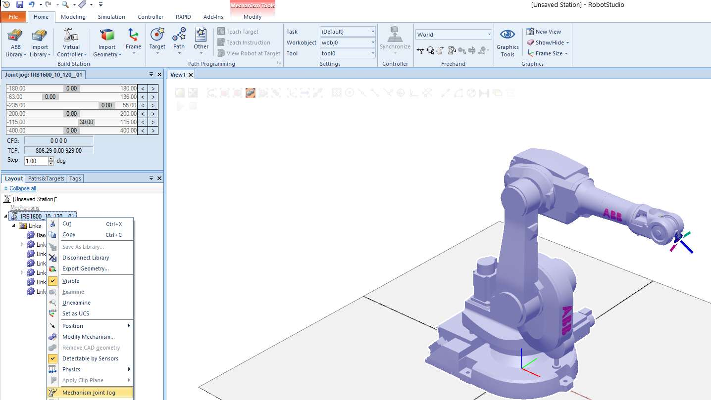

---

## Page 9

How do we go between joint-values and pose? vice verca?
Tool Center Point 
(TCP)

### Images

#### Image 1 (Page 9)
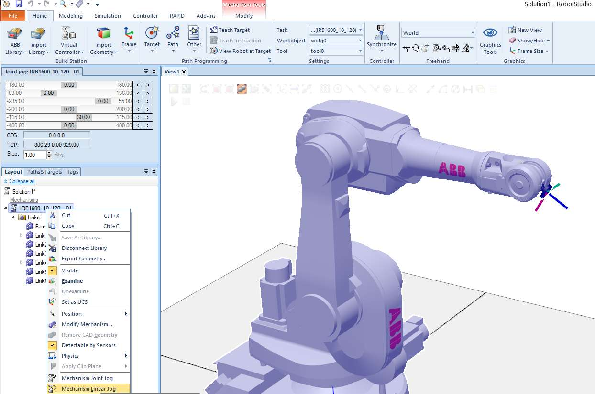

#### Image 2 (Page 9)
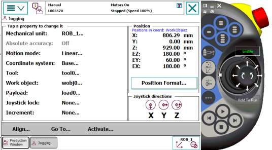

---

## Page 10

How do we go between linear- and axis-wise jogging?

### Images

#### Image 1 (Page 10)

#### Image 2 (Page 10)
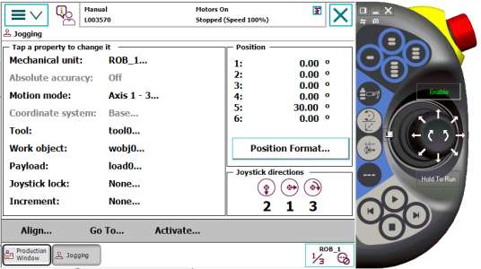

---

## Page 11

How do we go between robtarget and jointtarget?

### Images

#### Image 1 (Page 11)
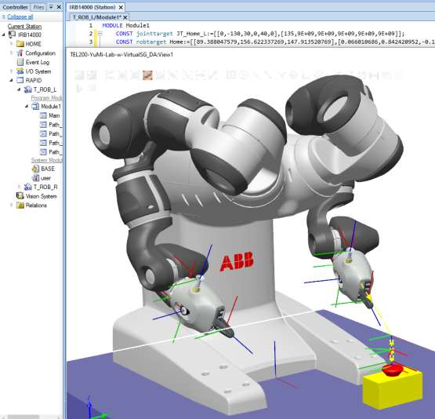

---

## Page 12

How do we go between robtarget and jointtarget?

### Images

#### Image 1 (Page 12)
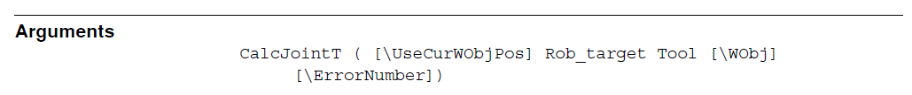

#### Image 2 (Page 12)
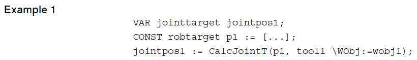

#### Image 3 (Page 12)
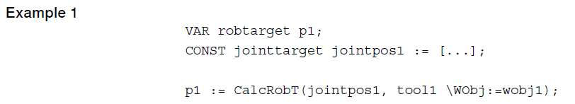

#### Image 4 (Page 12)

---

## Page 13

Arm Types
• Arm-type robots or robot manipulators are a very common type of robot.
2
IRB 910SC
IRB 360
Parallel/Delta robot
Payload: up to 8 kg
Reach: 0,8 – 1,6 m
SCARA robot
Payload: 6 kg
Reach: 0.45, 0.55, 0.65 m

### Images

#### Image 1 (Page 13)

#### Image 2 (Page 13)

#### Image 3 (Page 13)

#### Image 4 (Page 13)

#### Image 5 (Page 13)

---

## Page 14

Arm Types
• Arm-type robots or robot manipulators are a very common type of robot.
2
IRB 910SC
IRB 360
Parallel/Delta robot
SCARA robot
•
Food handling
•
Picking and packing tasks
•
Material handling
•
Small parts assembly
•
Inspection

### Images

#### Image 1 (Page 14)

#### Image 2 (Page 14)
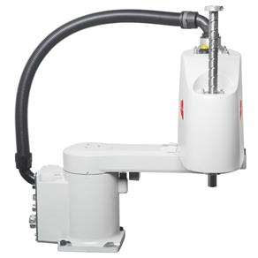

#### Image 3 (Page 14)

#### Image 4 (Page 14)

#### Image 5 (Page 14)

---

## Page 15

Arm Types
• Arm-type robots or robot manipulators are a very common type of robot.
2
IRB 6620LX
IRB 660
Gantry robot
Articulated robot
Payload: 150 kg
Reach: 1.8 – 33.0 m (L) 
             2.5 – 4.0 m (H)
Payload: 250 kg
Reach: 3.15 m

### Images

#### Image 1 (Page 15)
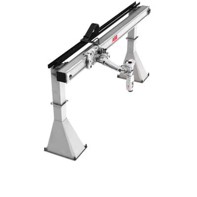

#### Image 2 (Page 15)

#### Image 3 (Page 15)

#### Image 4 (Page 15)

#### Image 5 (Page 15)

#### Image 6 (Page 15)

#### Image 7 (Page 15)

---

## Page 16

Arm Types
• Arm-type robots or robot manipulators are a very common type of robot.
2
IRB 6620LX
IRB 660
•
Material handling
•
Palletizing
•
Machine tending
•
Heavy arc welding
•
Grinding
•
Painting

### Images

#### Image 1 (Page 16)

#### Image 2 (Page 16)

---

## Page 17

Arm Types
• Arm-type robots or robot manipulators are a very common type of robot.
2
YuMi – IRB 14050
YuMi – IRB 14000
Dual-arm robot
Single-arm robot
Inherently safe design: rounded edges, lightweight, power/force limitation, force/torque (F/T) sensors;

### Images

#### Image 1 (Page 17)
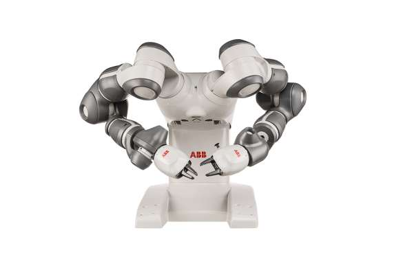

#### Image 2 (Page 17)

#### Image 3 (Page 17)

#### Image 4 (Page 17)

#### Image 5 (Page 17)

#### Image 6 (Page 17)

#### Image 7 (Page 17)

#### Image 8 (Page 17)

---

## Page 18

Arm Types
• Arm-type robots or robot manipulators are a very common type of robot.
2
YuMi – IRB 14050
YuMi – IRB 14000
Human-robot collaboration:
•
Assembly 
•
Pharmaceutical
•
Healthcare

### Images

#### Image 1 (Page 18)

#### Image 2 (Page 18)
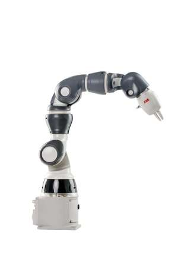

---

## Page 19

Manipulators with branching chains
Atlas
HUBO2
Spot

### Images

#### Image 1 (Page 19)
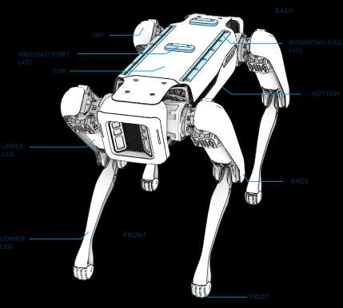

#### Image 2 (Page 19)
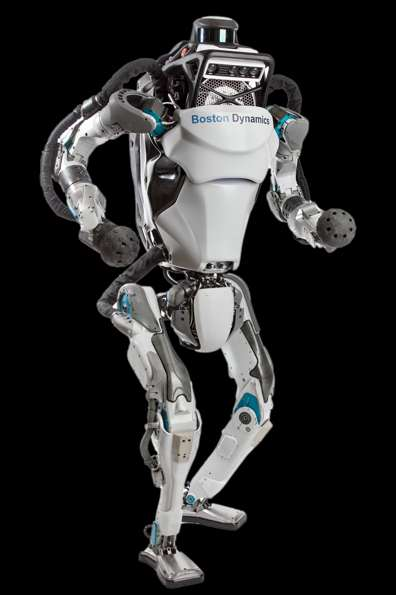

#### Image 3 (Page 19)
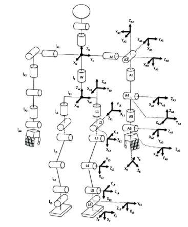

---

## Page 20

Industrial robots
• Classification: serial mechanical structure;
a.
Spherical (1%);
b.
Cylindrical (12%);
c.
Cartesian (20%) ;
d.
Articulated (59%);
e.
SCARA (8%).
2
- (b)
- (a)
- (c)
- (e)
- (d)
Source IFR (2019): Percentage of installed
robot manipulators worldwide.

### Images

#### Image 1 (Page 20)
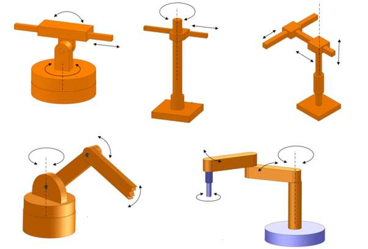

#### Image 2 (Page 20)

---

## Page 21

Introduction
• A robot arm, more formally a serial-link manipulator, comprises a chain of
rigid links and joints;
2

---

## Page 22

Introduction
• A robot arm, more formally a serial-link manipulator, comprises a chain of
rigid links and joints;
• Each joint has one Degree of Freedom (DoF), either translational (a sliding or
prismatic joint) or rotational (a revolute joint).
2
Prismatic
Revolute
Schematic representation of robot joints [2].

### Images

#### Image 1 (Page 22)
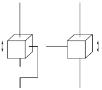

#### Image 2 (Page 22)
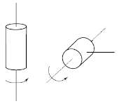

---

## Page 23

Introduction
• Motion of a given joint changes the relative pose of the links that it connects;
• One end of the chain, the base, is generally fixed and the other end is free to
move in space and holds the tool or end-effector that does the useful work.
2
{𝐵}
{𝐸}
Schematic representation of a robot arm [2].

### Images

#### Image 1 (Page 23)
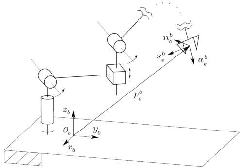

---

## Page 24

Introduction
• Motion of a given joint changes the relative pose of the links that it connects;
• One end of the chain, the base, is generally fixed and the other end is free to
move in space and holds the tool or end-effector that does the useful work.
2
{𝐵}
{𝐸}
Position:       𝑝𝑒𝑏= [ 𝑥𝑒𝑏 𝑦𝑒𝑏 𝑧𝑒𝑏 ]
Orientation:  𝑅𝑒𝑏= 𝑛𝑒𝑏𝑠𝑒𝑏𝑎𝑒𝑏
Schematic representation of a robot arm [2].

### Images

#### Image 1 (Page 24)

---

## Page 25

Forward Kinematics (Ch. 7.1)
• Forward kinematics is the mapping from joint coordinates 𝒒, or robot
configuration, to end-effector pose 𝝃𝑬given by:
where 𝒦⋅is - in general - a nonlinear function
2
𝝃𝑬=  𝒦(𝒒)
(1)
Forward kinematics
Backward kinematics
q  
 𝝃

---

## Page 26

2-Dimensional (Planar) Robotic Arms
• Consider this simple robot arm, which has a single rotational joint.
2
Planar arm with one rotational joint.

### Images

#### Image 1 (Page 26)

---

## Page 27

2-Dimensional (Planar) Robotic Arms
• Consider this simple robot arm, which has a single rotational joint.
• We can describe the pose of its end-effector – frame {𝐸} – by a sequence of
relative poses:
…a rotation about the joint axis 𝑞1 and then a translation by 𝑎1 along the
rotated 𝑥-axis;
2
Planar arm with one rotational joint.

### Images

#### Image 1 (Page 27)
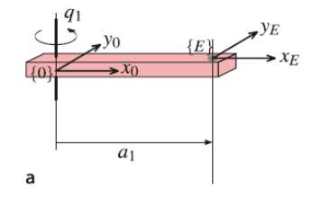

---

## Page 28

2-Dimensional (Planar) Robotic Arms
• Consider this simple robot arm, which has a single rotational joint.
• We can describe the pose of its end-effector – frame {𝐸} – by a sequence of
relative poses:
2
(2)
Planar arm with one rotational joint.

### Images

#### Image 1 (Page 28)
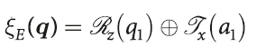

#### Image 2 (Page 28)

---

## Page 29

2-Dimensional (Planar) Robotic Arms
• Then, the forward kinematics map is given by:
2
𝜉𝑞=
cos 𝑞1
−sin 𝑞1
𝑎1 cos 𝑞1
sin 𝑞1
 cos 𝑞1 
𝑎1 sin 𝑞1
0
0
1
(3)

---

## Page 30

2-Dimensional (Planar) Robotic Arms
• Then, the forward kinematics map is given by:
• The forward kinematics, for a particular value of 𝑞1 = 30 deg and for the case
𝑎1 = 1 m, yields:
which is an SE(2) homogeneous transformation matrix representing the pose of
the end-effector – coordinate frame {𝐸}.
2
𝜉𝑞=
cos 𝑞1
−sin 𝑞1
𝑎1 cos 𝑞1
sin 𝑞1
 cos 𝑞1 
𝑎1 sin 𝑞1
0
0
1
(3)
𝜉30 =
0.8660
−0.5000
0.8600
0.5000
 0.8660
0.5000
0
0
1
(4)

---

## Page 31

2-Dimensional (Planar) Robotic Arms
• Consider now a robot arm with two joints
• The pose of the end-effector is given by:
2
Planar arm with two rotational joints.
(5)

### Images

#### Image 1 (Page 31)
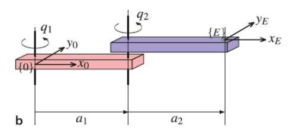

#### Image 2 (Page 31)
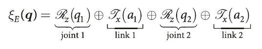

---

## Page 32

2-Dimensional (Planar) Robotic Arms
• Then, the forward kinematics map is given by:
2
𝜉𝑞=
cos 𝑞12
−sin 𝑞12
𝑎1 cos 𝑞1 + 𝑎2 cos 𝑞12
sin 𝑞12
 cos 𝑞12 
𝑎1 sin 𝑞1 + 𝑎2 sin 𝑞12
0
0
1
𝑞12 = 𝑞1 + 𝑞2
(6)

---

## Page 33

2-Dimensional (Planar) Robotic Arms
• Then, the forward kinematics map is given by:
• The forward kinematics, for a particular value of 𝑞1 = 30 deg and 𝑞2 = 40 deg,
and for the case 𝑎1 = 𝑎2 = 1 m, yields:
which is an SE(2) homogeneous transformation matrix representing the pose of
the end-effector – coordinate frame {𝐸}.
2
𝜉𝑞=
cos 𝑞12
−sin 𝑞12
𝑎1 cos 𝑞1 + 𝑎2 cos 𝑞12
sin 𝑞12
 cos 𝑞12 
𝑎1 sin 𝑞1 + 𝑎2 sin 𝑞12
0
0
1
(6)
𝜉30, 40 =
0.3420
−0.9397
1.208
0.9397
 0.3420
1.440
0
0
1
(7)
𝑞12 = 𝑞1 + 𝑞2

---

## Page 34

2-Dimensional (Planar) Robotic Arms
• So far, we have only considered revolute joints, but we could use a prismatic
joint instead
2
Planar arm with two joints: one 
rotational and one prismatic.

### Images

#### Image 1 (Page 34)
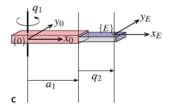

---

## Page 35

2-Dimensional (Planar) Robotic Arms
• So far, we have only considered revolute joints, but we could use a prismatic
joint instead
• The pose of the end-effector is given by:
2
Planar arm with two joints: one 
rotational and one prismatic.
(8)

### Images

#### Image 1 (Page 35)

#### Image 2 (Page 35)
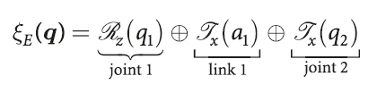

---

## Page 36

2-Dimensional (Planar) Robotic Arms
• We can easily add a third (revolute) joint
and use the now familiar functionality to represent and work with this arm.
where:
2
𝜉𝑞=
cos 𝑞123
−sin 𝑞123
𝑎1 cos 𝑞1 + 𝑎2 cos 𝑞12 + 𝑎3 cos 𝑞123
sin 𝑞123
 cos 𝑞123 
𝑎1 sin 𝑞1 + 𝑎2 sin 𝑞12 + 𝑎3 sin 𝑞123
0
0
1
(10)
𝑞123 = 𝑞1 + 𝑞2 + 𝑞3
(9)
(11)

### Images

#### Image 1 (Page 36)
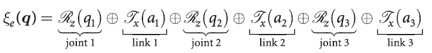

---

## Page 37

2-Dimensional (Planar) Robotic Arms
• We can easily add a third (revolute) joint
and use the now familiar functionality to represent and work with this arm.
• This robot has 3 degrees of freedom and is able to access all points in the task
space 𝒯⊂𝐒𝐄(2), that is, achieve any pose in the plane (limited by reach).
2
(9)
𝜉𝑞=
cos 𝑞123
−sin 𝑞123
𝑎1 cos 𝑞1 + 𝑎2 cos 𝑞12 + 𝑎3 cos 𝑞123
sin 𝑞123
 cos 𝑞123 
𝑎1 sin 𝑞1 + 𝑎2 sin 𝑞12 + 𝑎3 sin 𝑞123
0
0
1
(10)

### Images

#### Image 1 (Page 37)

---

## Page 38

3-Dimensional (Planar) Robotic Arms
• Truly useful robot arms have a task space 𝒯⊂𝐒𝐄(3) enabling arbitrary
position and orientation of the end-effector.
• This requires a robot arm with a configuration space dim 𝒞≥dim 𝒯which
can be achieved by a robot with 6 (six) or more joints.
2

---

## Page 39

3-Dimensional (Planar) Robotic Arms
• We can extend the technique from the previous
section for a robot like the Puma 560
2
Puma robot in the zero joint-angle configuration showing 
dimensions and joint axes.

### Images

#### Image 1 (Page 39)

---

## Page 40

3-Dimensional (Planar) Robotic Arms
• We can extend the technique from the previous
section for a robot like the Puma 560
• Starting with the world frame {0} we move up,
rotate about the waist axis (𝑞1), rotate about
the shoulder axis (𝑞2), move to the left, move
up and so on.
2
Puma robot in the zero joint-angle configuration showing 
dimensions and joint axes.

### Images

#### Image 1 (Page 40)

---

## Page 41

3-Dimensional (Planar) Robotic Arms
• We can extend the technique from the previous
section for a robot like the Puma 560
• Starting with the world frame {0} we move up,
rotate about the waist axis (𝑞1), rotate about
the shoulder axis (𝑞2), move to the left, move
up and so on.
2
Puma robot in the zero joint-angle configuration showing 
dimensions and joint axes.

### Images

#### Image 1 (Page 41)
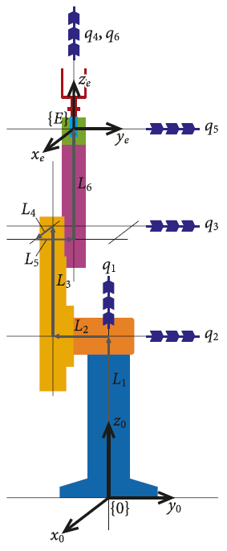

#### Image 2 (Page 41)
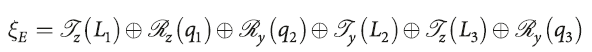

#### Image 3 (Page 41)
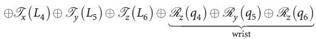

---

## Page 42

3-Dimensional (Planar) Robotic Arms
• Then, we write down the complete transform expression:
• The wrist term represents a ZYZ Euler angle sequence and provides arbitrary 
orientation but is subject to a singularity when the middle angle q5= 0.
2
(12)

### Images

#### Image 1 (Page 42)
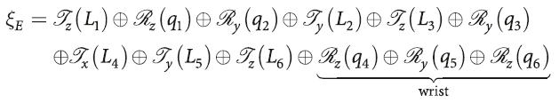

---

## Page 43

• The pose of the end effector is
where j𝜉j + 1 𝑞j is the pose of link frame {j+1} w.r.t. link {j}
• In functional form
FK as a chain of Robot Links
[formula text unreadable from PDF encoding; see source PDF/image]

### Images

#### Image 1 (Page 43)
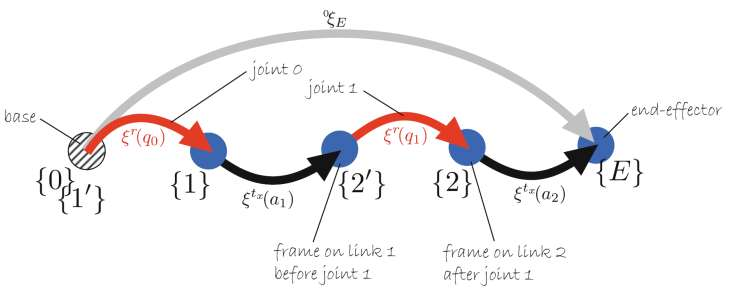

#### Image 2 (Page 43)
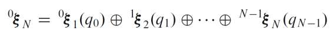

#### Image 3 (Page 43)
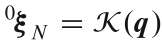

---

## Page 44

3-Dimensional (Planar) Robotic Arms
• While this notation is somehow intuitive, it does become cumbersome as the
number of robot joints increases.
• Several approaches have been developed to more concisely describe the
motion of a serial-link robotic arm:
– Denavit-Hartenberg (DH) notation (Ch. 7.1.5)
– Product of exponentials (not included in TEL200)
• While many other conventions have been developed, the DH convention 
remains the standard approach
2

---

## Page 45

Denavit-Hartenberg Parameters
• One systematic way of describing the geometry of a serial chain of links and
joints is Denavit-Hartenberg notation.
2
Tab. 7.2 - Denavit-Hartenberg parameters: their symbol, physical meaning, and formal definition.

### Images

#### Image 1 (Page 45)
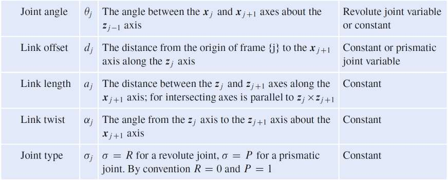

---

## Page 46

Denavit-Hartenberg Parameters
• One systematic way of describing the geometry of a serial chain of links and
joints is Denavit-Hartenberg notation.
2
Fig. 7.18: Definition of standard Denavit-Hartenberg link parameters.
•
The colors red and blue denote all things associated
with links 𝑗−1 and 𝑗respectively;
•
The numbers in circles
represent the order in which
the elementary transforms are applied;
•
The unit vector 𝑥𝑗is parallel to 𝑧𝑗−1 × 𝑧𝑗and if those
two axes are parallel then 𝑑𝑗can be chosen arbitrarily.
1

### Images

#### Image 1 (Page 46)
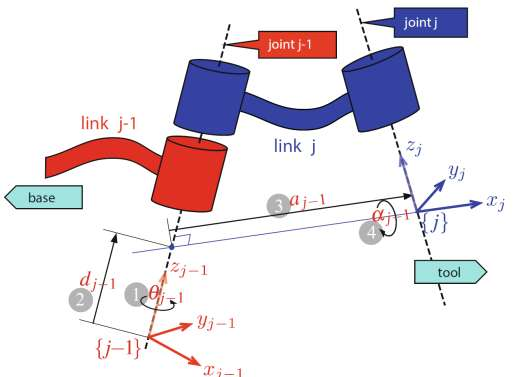

---

## Page 47

Denavit-Hartenberg Parameters
• The transformation from link coordinate frame {𝑗} to frame {𝑗+ 1} is defined in
terms of elementary rotations and translations as
which can be expanded in homogeneous matrix form in SE(3) as
2
[formula text unreadable from PDF encoding; see source PDF/image]

### Images

#### Image 1 (Page 47)

#### Image 2 (Page 47)

---

## Page 48

Denavit-Hartenberg Parameters
• The transformation from link coordinate frame {𝑗} to frame {𝑗+ 1} is defined in
terms of elementary rotations and translations as
which can be expanded in homogeneous matrix form in SE(3) as
2
[formula text unreadable from PDF encoding; see source PDF/image]
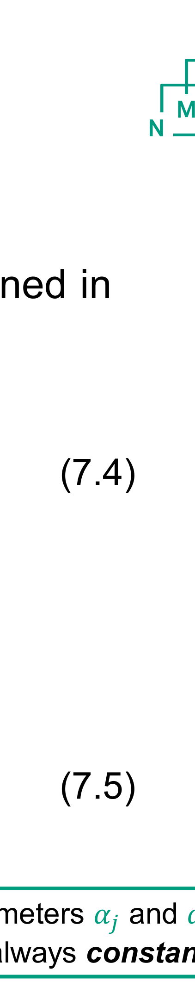
Parameters 𝛼𝑗 and 𝑎𝑗 are
always constant

### Images

#### Image 1 (Page 48)

#### Image 2 (Page 48)

---

## Page 49

Denavit-Hartenberg Parameters
• The transformation from link coordinate frame {𝑗} to frame {𝑗+ 1} is defined in
terms of elementary rotations and translations as
which can be expanded in homogeneous matrix form in SE(3) as
2
[formula text unreadable from PDF encoding; see source PDF/image]
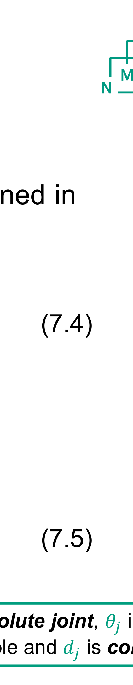
For a revolute joint, 𝜃𝑗 is the joint 
variable and 𝑑𝑗 is constant

### Images

#### Image 1 (Page 49)

#### Image 2 (Page 49)
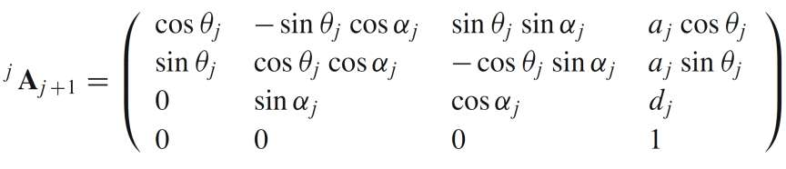

---

## Page 50

Denavit-Hartenberg Parameters
• The transformation from link coordinate frame {𝑗} to frame {𝑗+ 1} is defined in
terms of elementary rotations and translations as
which can be expanded in homogeneous matrix form in SE(3) as
2
[formula text unreadable from PDF encoding; see source PDF/image]
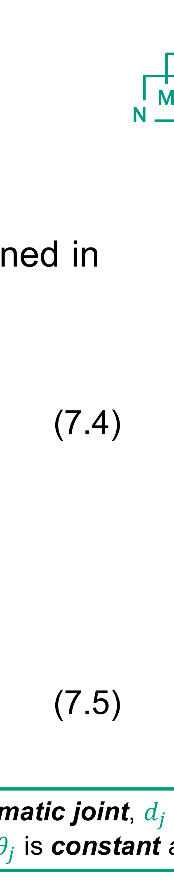
For a prismatic joint, 𝑑𝑗 is the joint 
variable, 𝜃𝑗 is constant and 𝛼𝑗= 0

### Images

#### Image 1 (Page 50)

#### Image 2 (Page 50)

---

## Page 51

Denavit-Hartenberg Parameters
• The transformation from link coordinate frame {𝑗} to frame {𝑗+ 1} is defined in
terms of elementary rotations and translations as
which can be expanded in homogeneous matrix form in SE(3) as
2
[formula text unreadable from PDF encoding; see source PDF/image]
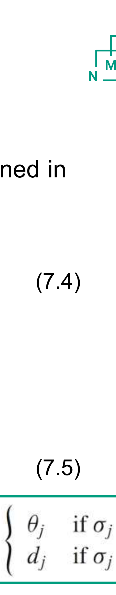

### Images

#### Image 1 (Page 51)
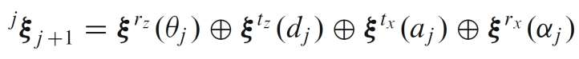

#### Image 2 (Page 51)

#### Image 3 (Page 51)
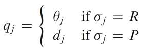

---

## Page 52

• Using DH convention, a link is specified by only four parameters while it in general 
would entail six parameters; three each for translation and rotation.
• This is due to the two imposed constraints: 
1.
Position: 
axis xj intersects zj−1
2.
Orientation: 
axis xj is perpendicular to zj−1.
Consequently:
1.
The link coordinate frame might be outside the actual, physical robot links!
2.
The robot must have a particular “zero-angle configuration” that might even be 
mechanically unachievable!
Denavit-Hartenberg Parameters

---

## Page 53

• Useful to add tools and base by extending FK expression of (7.1) with 2 transforms:
FK as a chain of Robot Links
[formula text unreadable from PDF encoding; see source PDF/image]

### Images

#### Image 1 (Page 53)

#### Image 2 (Page 53)
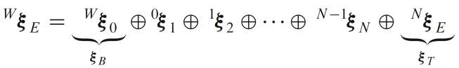

---

## Page 54

• Useful to add tools and base by extending FK expression of (7.1) with 2 transforms:
FK as a chain of Robot Links
[formula text unreadable from PDF encoding; see source PDF/image]

The base transform 𝜉𝐵puts the base of the robot arm at an arbitrary pose
within the world coordinate frame.

### Images

#### Image 1 (Page 54)
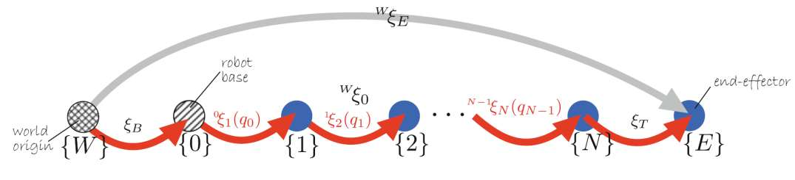

#### Image 2 (Page 54)

---

## Page 55

• Useful to add tools and base by extending FK expression of (7.1) with 2 transforms:
FK as a chain of Robot Links
[formula text unreadable from PDF encoding; see source PDF/image]
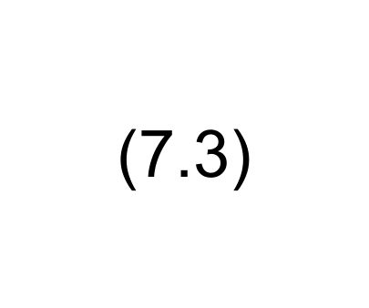
The frame {𝑁} is often defined as the center of the spherical wrist mechanism,
and the tool transform 𝜉𝑇describes the pose of the tool tip with respect to that.

### Images

#### Image 1 (Page 55)

#### Image 2 (Page 55)

---

## Page 56

Robotics Toolbox - Denavit-Hartenberg (DH) 
• Determining the DH parameters for a particular robot is challenging, but the 
Robotics Toolbox includes many robot models
2

### Images

#### Image 1 (Page 56)
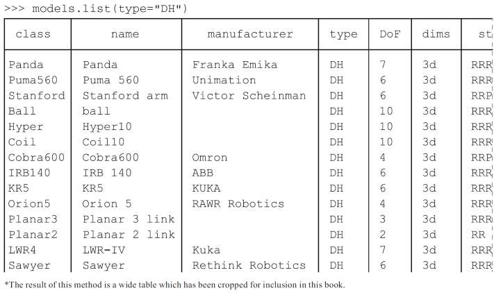

---

## Page 57

Robotics Toolbox - Denavit-Hartenberg (DH) 
$$
>>> irb140 = models.DH.IRB140();
$$
ready
zero
dextrous/normal

### Images

#### Image 1 (Page 57)

#### Image 2 (Page 57)

---

## Page 58

Denavit-Hartenberg convention – Ethan Tira-Thompson
• Video clip:
2

### Images

#### Image 1 (Page 58)

---

## Page 59

Denavit-Hartenberg convention – Peter Corke
NB. RVC Ed 3 (Python) uses Zero-Based Indexing, i.e. indexed starting from zero (video uses 1-based, form Ed 2)

### Images

#### Image 1 (Page 59)

---

## Page 60

Inverse Kinematics (Ch. 7.2)
• We have shown how to determine the pose of the end-effector given the joint
coordinates and optional tool and base transforms.
• Another problem with real practical interest is the inverse problem:
2
Given the desired pose of the end-effector  𝝃𝑬what 
are the required joint coordinates 𝒒?
Forward kinematics
Backward kinematics
q
𝝃E

---

## Page 61

Inverse Kinematics
• This is called the inverse kinematics problem which is written in functional
form as
and, in general, this function is not unique, that is, several joint coordinate
vectors 𝒒may result in the same end-effector pose 𝜉E;
2
𝜉
𝑞
𝒦(⋅)
[formula text unreadable from PDF encoding; see source PDF/image]

### Images

#### Image 1 (Page 61)

#### Image 2 (Page 61)

#### Image 3 (Page 61)

#### Image 4 (Page 61)

---

## Page 62

Inverse Kinematics
• This is called the inverse kinematics problem which is written in functional
form as
and, in general, this function is not unique, that is, several joint coordinate
vectors 𝒒may result in the same end-effector pose 𝜉E;
2
[formula text unreadable from PDF encoding; see source PDF/image]

𝜉1 = 𝒦(𝑞1)
𝜉2 = 𝒦(𝑞2)
𝜉3 = 𝒦(𝑞3)
𝑞
𝜉1
𝜉2
𝑞1
𝑞2
𝑞3
𝜉3
𝜉
𝒦(⋅)

### Images

#### Image 1 (Page 62)

#### Image 2 (Page 62)

#### Image 3 (Page 62)

#### Image 4 (Page 62)

#### Image 5 (Page 62)

#### Image 6 (Page 62)

#### Image 7 (Page 62)

#### Image 8 (Page 62)

#### Image 9 (Page 62)

#### Image 10 (Page 62)

---

## Page 63

Inverse Kinematics
• This is called the inverse kinematics problem which is written in functional
form as
and, in general, this function is not unique, that is, several joint coordinate
vectors 𝒒may result in the same end-effector pose 𝜉E;
2
[formula text unreadable from PDF encoding; see source PDF/image]

𝑞1 = 𝒦−1(𝜉1)
𝑞2 = 𝒦−1(𝜉2)
𝑞3 = 𝒦−1(𝜉3)
𝑞
𝜉1
𝜉2
𝑞1
𝑞2
𝑞3
𝜉3
𝜉
𝒦(⋅)

### Images

#### Image 1 (Page 63)

#### Image 2 (Page 63)

#### Image 3 (Page 63)

#### Image 4 (Page 63)

#### Image 5 (Page 63)

#### Image 6 (Page 63)

#### Image 7 (Page 63)

#### Image 8 (Page 63)

#### Image 9 (Page 63)

#### Image 10 (Page 63)

---

## Page 64

Inverse Kinematics
• This is called the inverse kinematics problem which is written in functional
form as
and, in general, this function is not unique, that is, several joint coordinate
vectors 𝒒may result in the same end-effector pose 𝜉E;
2
[formula text unreadable from PDF encoding; see source PDF/image]

Multiple solutions !
𝑞
𝜉1
𝜉2
𝑞1
𝑞2
𝑞3
𝜉3
𝜉
𝒦(⋅)
𝑞1 = 𝒦−1(𝜉1)
𝑞2 = 𝒦−1(𝜉2)
𝑞3 = 𝒦−1(𝜉3)

### Images

#### Image 1 (Page 64)

#### Image 2 (Page 64)

#### Image 3 (Page 64)

#### Image 4 (Page 64)

#### Image 5 (Page 64)

#### Image 6 (Page 64)

#### Image 7 (Page 64)

#### Image 8 (Page 64)

#### Image 9 (Page 64)

#### Image 10 (Page 64)

#### Image 11 (Page 64)

#### Image 12 (Page 64)

#### Image 13 (Page 64)

#### Image 14 (Page 64)

#### Image 15 (Page 64)

#### Image 16 (Page 64)

#### Image 17 (Page 64)

#### Image 18 (Page 64)

---

## Page 65

Inverse Kinematics
• This is called the inverse kinematics problem which is written in functional
form as
and, in general, this function is not unique, that is, several joint coordinate
vectors 𝒒may result in the same end-effector pose 𝜉E;
2
[formula text unreadable from PDF encoding; see source PDF/image]

𝜉
𝑞
𝒦(⋅)
𝜉4
𝜉5
No solutions !
𝑞4 = 𝒦−1(𝜉4)
𝑞5 = 𝒦−1(𝜉5)

### Images

#### Image 1 (Page 65)

#### Image 2 (Page 65)

#### Image 3 (Page 65)

#### Image 4 (Page 65)

#### Image 5 (Page 65)

#### Image 6 (Page 65)

---

## Page 66

Inverse Kinematics
• Two main approaches can be used to determine the inverse kinematics.
1.
Closed form or analytical solution;
2.
An iterative numerical solution.
2

---

## Page 67

2-Dimensional (Planar) Robotic Arms
• We will illustrate inverse kinematics for a simple 2-joint robot two ways:
1.
Algebraic closed-form
2.
Numerical solution
2
Given the desired pose of the end-effector  𝝃𝑬what are the required joint coordinates 𝒒0 and 𝒒1?
Planar arm with two rotational joints.

### Images

#### Image 1 (Page 67)

---

## Page 68

Closed-form Solution
• Compute the forward kinematics symbolically using SymPy:
>>> import sympy
$$
>>> a1, a2 = sympy.symbols("a1 a2")
$$
$$
>>> e = ET2.R() * ET2.tx(a1) * ET2.R() * ET2.tx(a2);
$$
• Define symbolic variables for the joint angles
$$
>>> q0, q1 = sympy.symbols("q0 q1")
$$
• Compute forward kinematics as an SE(2) matrix
$$
>>> TE = e.fkine([q0, q1])
$$
cos(q0 + q1) -sin(q0 + q1) a1*cos(q0) + a2*cos(q0 + q1)
sin(q0 + q1) cos(q0 + q1) a1*sin(q0) + a2*sin(q0 + q1)
0 0 1
2

### Images

#### Image 1 (Page 68)

#### Image 2 (Page 68)

#### Image 3 (Page 68)

#### Image 4 (Page 68)

#### Image 5 (Page 68)

#### Image 6 (Page 68)

#### Image 7 (Page 68)

#### Image 8 (Page 68)

#### Image 9 (Page 68)

#### Image 10 (Page 68)

#### Image 11 (Page 68)

#### Image 12 (Page 68)

#### Image 13 (Page 68)

#### Image 14 (Page 68)

#### Image 15 (Page 68)

#### Image 16 (Page 68)

#### Image 17 (Page 68)

#### Image 18 (Page 68)

#### Image 19 (Page 68)

---

## Page 69

Closed-form Solution
• Consider just the end-effector position
>>> x_fk, y_fk = TE.t; 
• Define desired end-effector position using two more symbolic variables
$$
>>> x, y = sympy.symbols("x y")
$$
• Two equations and two unknowns: 
• SymPy need some help to solve such trigonometric equations
• Square both equations and add them: 
• Rewrite as:
2

### Images

#### Image 1 (Page 69)

#### Image 2 (Page 69)

#### Image 3 (Page 69)

#### Image 4 (Page 69)

#### Image 5 (Page 69)

#### Image 6 (Page 69)

#### Image 7 (Page 69)

#### Image 8 (Page 69)

#### Image 9 (Page 69)

#### Image 10 (Page 69)

#### Image 11 (Page 69)

---

## Page 70

Closed-form Solution – Solving for q1
$$
>>> eq1 = (x_fk**2 + y_fk**2 - x**2 - y**2).trigsimp()
$$
a1**2 + 2*a1*a2*cos(q1) + a2**2 - x**2 - y**2
$$
>>> q1_sol = sympy.solve(eq1, q1)
$$
[-acos(-(a1**2 + a2**2 - x**2 - y**2)/(2*a1*a2)) + 2*pi,
acos((-a1**2 - a2**2 + x**2 + y**2)/(2*a1*a2)) 
• Eq1 has only one unknown, q1 
• q1_sol is a list. 
• Correspont to pos or neg q1
• IK problem does not have 
unique solution

### Images

#### Image 1 (Page 70)

#### Image 2 (Page 70)

#### Image 3 (Page 70)

#### Image 4 (Page 70)

#### Image 5 (Page 70)

#### Image 6 (Page 70)

#### Image 7 (Page 70)

#### Image 8 (Page 70)

#### Image 9 (Page 70)

#### Image 10 (Page 70)

#### Image 11 (Page 70)

#### Image 12 (Page 70)

#### Image 13 (Page 70)

#### Image 14 (Page 70)

#### Image 15 (Page 70)

#### Image 16 (Page 70)

#### Image 17 (Page 70)

#### Image 18 (Page 70)

#### Image 19 (Page 70)

#### Image 20 (Page 70)

#### Image 21 (Page 70)

#### Image 22 (Page 70)

#### Image 23 (Page 70)

#### Image 24 (Page 70)

---

## Page 71

Closed-form Solution – Solving for q0
• For q0, we first expand the two equations:
$$
>>> eq0 = tuple(map(sympy.expand_trig, [x_fk - x, y_fk - y]))
$$
(a1*cos(q0) + a2*(-sin(q0)*sin(q1) + cos(q0)*cos(q1)) - x,
a1*sin(q0) + a2*(sin(q0)*cos(q1) + sin(q1)*cos(q0)) - y)
• solve them for sin(q0) and cos(q0)
$$
>>> q0_sol = sympy.solve(eq0, [sympy.sin(q0), sympy.cos(q0)]);
$$
• The ratio of these is tan(q0)
>>> sympy.atan2(q0_sol[sympy.sin(q0)], q0_sol[sympy.cos(q0)]).simplify()
atan2((a1*y - a2*x*sin(q1) + a2*y*cos(q1))/(a1**2 + 2*a1*a2*cos(q1)+ a2**2),
(a1*x + a2*x*cos(q1) + a2*y*sin(q1))/(a1**2 + 2*a1*a2*cos(q1)+ a2**2))

### Images

#### Image 1 (Page 71)

#### Image 2 (Page 71)

#### Image 3 (Page 71)

#### Image 4 (Page 71)

#### Image 5 (Page 71)

#### Image 6 (Page 71)

#### Image 7 (Page 71)

#### Image 8 (Page 71)

#### Image 9 (Page 71)

#### Image 10 (Page 71)

#### Image 11 (Page 71)

#### Image 12 (Page 71)

#### Image 13 (Page 71)

#### Image 14 (Page 71)

#### Image 15 (Page 71)

#### Image 16 (Page 71)

#### Image 17 (Page 71)

#### Image 18 (Page 71)

#### Image 19 (Page 71)

#### Image 20 (Page 71)

#### Image 21 (Page 71)

#### Image 22 (Page 71)

#### Image 23 (Page 71)

#### Image 24 (Page 71)

#### Image 25 (Page 71)

#### Image 26 (Page 71)

#### Image 27 (Page 71)

#### Image 28 (Page 71)

#### Image 29 (Page 71)

#### Image 30 (Page 71)

#### Image 31 (Page 71)

#### Image 32 (Page 71)

#### Image 33 (Page 71)

#### Image 34 (Page 71)

#### Image 35 (Page 71)

#### Image 36 (Page 71)

#### Image 37 (Page 71)

#### Image 38 (Page 71)

#### Image 39 (Page 71)

#### Image 40 (Page 71)

#### Image 41 (Page 71)

#### Image 42 (Page 71)

#### Image 43 (Page 71)

#### Image 44 (Page 71)

#### Image 45 (Page 71)

#### Image 46 (Page 71)

#### Image 47 (Page 71)

---

## Page 72

Closed-form Solution
• SymPy is comparatively weak at trigonometric expressions
• More powerful symbolic tools exist
• The complexity of algebraic solution increases dramatically with the number
of joints and more sophisticated symbolic solution approaches need to be
used.
• In Matlab, the ikine_sym method generates symbolic inverse kinematics
solutions for a limited class of robot manipulators.
2

---

## Page 73

Numerical Solution
• We can think of the inverse kinematics problem as one of adjusting the joint
coordinates 𝑞until the forward kinematics 𝒦matches the desired pose p;
• More formally this is an optimization problem – to minimize the error
between the forward kinematic solution and the desired pose 𝜉∗;
• For our simple 2-link robot arm example the error function comprises only the
error in the end-effector position, not its orientation:
2
(23)
(24)

### Images

#### Image 1 (Page 73)

#### Image 2 (Page 73)

---

## Page 74

Numerical Solution
• We can solve this problem using the SciPy multi-variable minimization function
$$
>>> pstar = np.array([0.6, 0.7]); # desired position
$$
$$
>>> E = lambda q: np.linalg.norm(e.fkine(q).t - pstar); #define error
$$
$$
>>> sol = optimize.minimize(E, [0, 0]);
$$
>>> sol.x
array([ -0.2295, 2.183])
where the first argument is the error function, that incorporates the desired
end-effector position;
…and the second argument is the initial guess the joint coordinates.
2

### Images

#### Image 1 (Page 74)

#### Image 2 (Page 74)

#### Image 3 (Page 74)

#### Image 4 (Page 74)

#### Image 5 (Page 74)

#### Image 6 (Page 74)

#### Image 7 (Page 74)

#### Image 8 (Page 74)

#### Image 9 (Page 74)

#### Image 10 (Page 74)

#### Image 11 (Page 74)

#### Image 12 (Page 74)

#### Image 13 (Page 74)

#### Image 14 (Page 74)

#### Image 15 (Page 74)

#### Image 16 (Page 74)

#### Image 17 (Page 74)

#### Image 18 (Page 74)

---

## Page 75

Numerical Solution
• The computed joint angles indeed give the desired end-effector position as:
>>> e.fkine(sol.x).printline()
t = 0.6, 0.7; 112°
• As already discussed, there are two solutions for 𝑞but the solution that is
found depends on the initial choice of 𝑞 in optimize.minimize;
2
𝜉
𝑞

### Images

#### Image 1 (Page 75)

#### Image 2 (Page 75)

#### Image 3 (Page 75)

#### Image 4 (Page 75)

#### Image 5 (Page 75)

#### Image 6 (Page 75)

#### Image 7 (Page 75)

#### Image 8 (Page 75)

#### Image 9 (Page 75)

#### Image 10 (Page 75)

#### Image 11 (Page 75)

#### Image 12 (Page 75)

#### Image 13 (Page 75)

#### Image 14 (Page 75)

#### Image 15 (Page 75)

#### Image 16 (Page 75)

#### Image 17 (Page 75)

#### Image 18 (Page 75)

#### Image 19 (Page 75)

#### Image 20 (Page 75)

#### Image 21 (Page 75)

#### Image 22 (Page 75)

---

## Page 76

3-Dimensional Robotic Arms
• Closed-form solutions have been developed for 
most common types of 6-axis industrial robots and 
many are included in the Toolbox;
• A necessary condition for a closed-form solution 
of a 6-axis robot is a spherical wrist mechanism. 
• This is a gimbal-like mechanism: have a singularity. 
• It doesn’t cause any translation. So, position of 
end-effector is a function only of first three joints!
• An arbitrary end-effector orientation is achieved 
independently by means of the three wrist joints.
2

### Images

#### Image 1 (Page 76)

---

## Page 77

• Can be solved in a fixed number of operations (therefore, computationally fast)
• Results in all possible solutions to the manipulator kinematics
• Most desirable for real-time control
• Often difficult or even impossible to find
Inverser kinematics: analytical/closed-form solutions

---

## Page 78

• Results in a numerical, iterative solution to system of equations (optimization problem 
solved e.g., using Newton/Raphson techniques)
• Unknown number of operations to solve
• Only returns a single solution 
• Accuracy can be dictated by user but can prolong solution time
• Because of these reasons, this is much less desirable than a closed-form solution.
• Can be applied to all robots.
Inverser kinematics: numerical solution

---

## Page 79

Inverse kinematics for 6-DOF robot 
https://youtu.be/nLI6F6yjcfY

### Images

#### Image 1 (Page 79)

---

## Page 80

Forward and Inverse Kinematics
• Video clip:
2
https://youtu.be/SZP1KQ2qSEA

### Images

#### Image 1 (Page 80)

---

## Page 81

Trajectories (Ch. 7.3)
• One of the most common requirements in robotics is to move the robot end-
effector smoothly from pose A to pose B;
• Here, we will discuss two approaches to generating such trajectories: straight
lines in configuration space and straight lines in task space.
• These trajectories are known respectively as:
❑Cartesian motion (MoveL in RAPID) 
❑Joint-space motion (MoveJ/MoveAbsJ in RAPID)
2

---

## Page 82

Joint-space Motion
• Consider the end-effector moving between two Cartesian poses.
$$
>>> TE1 = SE3.Trans(0.4, -0.2, 0) * SE3.Rx(3);
$$
$$
>>> TE2 = SE3.Trans(0.4, 0.2, 0) * SE3.Rx(1);
$$
which describe points in the 𝑥𝑦-plane with different end-effector orientations. 
2

### Images

#### Image 1 (Page 82)

#### Image 2 (Page 82)

#### Image 3 (Page 82)

#### Image 4 (Page 82)

---

## Page 83

Joint-space Motion
• The joint coordinate vectors associated with these poses are given by:
$$
>>> sol1 = puma.ikine_a(TE1, "ru");
$$
$$
>>> sol2 = puma.ikine_a(TE2, "ru");
$$
where we have specified the right-handed elbow-up (ru) configuration
• We require the motion to occur over a time period of 2 seconds in 20 ms time
steps:
$$
>>> t = np.arange(0, 2, 0.02);
$$
2

### Images

#### Image 1 (Page 83)

#### Image 2 (Page 83)

#### Image 3 (Page 83)

#### Image 4 (Page 83)

#### Image 5 (Page 83)

#### Image 6 (Page 83)

#### Image 7 (Page 83)

#### Image 8 (Page 83)

#### Image 9 (Page 83)

#### Image 10 (Page 83)

#### Image 11 (Page 83)

#### Image 12 (Page 83)

#### Image 13 (Page 83)

#### Image 14 (Page 83)

#### Image 15 (Page 83)

#### Image 16 (Page 83)

#### Image 17 (Page 83)

#### Image 18 (Page 83)

#### Image 19 (Page 83)

#### Image 20 (Page 83)

---

## Page 84

Joint-space Motion
• A joint-space trajectory is formed by smoothly interpolating between the joint
configurations 𝑞1  and 𝑞2.
• The scalar interpolation functions quintic or trapezoidal can be used in
conjunction with the multi-axis driver function mtraj as:
$$
>>> traj = mtraj(quintic, sol1.q, sol2.q, t);
$$
or
$$
>>> traj = mtraj(trapezoidal, sol1.q, sol2.q, t);
$$
which each result in a trajectory matrix 𝑞∈ℝ100×6 with one row per time step
and one column per joint.
2

### Images

#### Image 1 (Page 84)

#### Image 2 (Page 84)

#### Image 3 (Page 84)

#### Image 4 (Page 84)

#### Image 5 (Page 84)

#### Image 6 (Page 84)

#### Image 7 (Page 84)

#### Image 8 (Page 84)

#### Image 9 (Page 84)

---

## Page 85

Joint-space Motion
• From here on we will use the equivalent jtraj convenience function
$$
>>> traj = jtraj(sol1.q, sol2.q, t)
$$
Trajectory created by jtraj: 100 time steps x 6 axes
• For mtraj and jtraj the final argument can be a time vector, as here, or an
integer specifying the number of time steps.
• Function jtraj is equivalent to mtraj with quintic interpolation but optimized for
the multi-axis case and also allowing initial- and final velocity to be set using
additional arguments;
2

### Images

#### Image 1 (Page 85)

#### Image 2 (Page 85)

#### Image 3 (Page 85)

#### Image 4 (Page 85)

#### Image 5 (Page 85)

#### Image 6 (Page 85)

#### Image 7 (Page 85)

#### Image 8 (Page 85)

#### Image 9 (Page 85)

#### Image 10 (Page 85)

---

## Page 86

Joint-space Motion
• The trajectory is best viewed as an animation
>>> puma.plot(traj.q);
but we can also plot the joint angles versus time
>>> xplot(t, traj.q);
2
Fig. 7.20. Joint-space motion. 
a Joint coordinates versus time;
b Cartesian position versus time;
c Cartesian position locus in the 𝑥𝑦-plane
d roll-pitch-yaw angles versus time

### Images

#### Image 1 (Page 86)

#### Image 2 (Page 86)

#### Image 3 (Page 86)

#### Image 4 (Page 86)

#### Image 5 (Page 86)

#### Image 6 (Page 86)

#### Image 7 (Page 86)

#### Image 8 (Page 86)

---

## Page 87

Cartesian Motion
• For many applications we require straight-line motion in Cartesian space
which is known as Cartesian motion.
• This is implemented using the Toolbox function ctraj
$$
>>> Ts = ctraj(TE1, TE2, t);
$$
where the arguments are the initial and final pose, T1 and T2, and the time 
steps and it returns the trajectory as an array of SE3 objects.
2

### Images

#### Image 1 (Page 87)

---

## Page 88

Cartesian Motion
• As for the previous joint-space example, now we will extract and plot the
translation
$$
>>> xplot(t, Ts.t, labels="x y z");
$$
and orientation components
$$
>>> xplot(t, Ts.rpy("xyz"), labels="roll pitch yaw");
$$
of this motion which is shown in Fig. 7.21 along with the path of the end-effector
in the 𝑥𝑦-plane.
2

### Images

#### Image 1 (Page 88)

#### Image 2 (Page 88)

#### Image 3 (Page 88)

#### Image 4 (Page 88)

#### Image 5 (Page 88)

#### Image 6 (Page 88)

#### Image 7 (Page 88)

#### Image 8 (Page 88)

#### Image 9 (Page 88)

#### Image 10 (Page 88)

#### Image 11 (Page 88)

#### Image 12 (Page 88)

#### Image 13 (Page 88)

#### Image 14 (Page 88)

#### Image 15 (Page 88)

#### Image 16 (Page 88)

#### Image 17 (Page 88)

#### Image 18 (Page 88)

#### Image 19 (Page 88)

#### Image 20 (Page 88)

#### Image 21 (Page 88)

#### Image 22 (Page 88)

---

## Page 89

Cartesian Motion
• The corresponding joint-space trajectory is 
obtained by applying the inverse kinematics
$$
>>> qc = puma.ikine_a(Ts);
$$
and is shown in Fig. 7.21a.
2
Fig. 7.21. Cartesian motion. 
a Joint coordinates versus time; 
b Cartesian position versus time; 
c Cartesian position locus in the xy-plane;
d roll-pitch-yaw angles versus time

### Images

#### Image 1 (Page 89)

#### Image 2 (Page 89)

#### Image 3 (Page 89)

#### Image 4 (Page 89)

#### Image 5 (Page 89)

#### Image 6 (Page 89)

#### Image 7 (Page 89)

---

## Page 90

Motion through a Singularity
• Here, we deliberately choose a joint
trajectory that moves through a robot
wrist singularity.
• We change the Cartesian endpoints of
the previous example to
$$
>>> TE1 = SE3.Trans(0.5, -0.3, 1.12) * SE3.OA((0, 1, 0), (1, 0, 0));
$$
$$
>>> TE2 = SE3.Trans(0.5, 0.3, 1.12) * SE3.OA((0, 1, 0), (1, 0, 0));
$$
which results in motion in the 𝑦-direction
with the end-effector 𝑧-axis pointing in the
world 𝑥-direction.
2
Fig. 7.22: Block diagram model models/jointspace 
for joint-space motion

### Images

#### Image 1 (Page 90)

#### Image 2 (Page 90)

#### Image 3 (Page 90)

#### Image 4 (Page 90)

#### Image 5 (Page 90)

---

## Page 91

Motion through a Singularity
• The Cartesian path is
$$
>>> Ts = ctraj(TE1, TE2, t);
$$
which we convert to joint coordinates
$$
>>> sol = puma.ikine_a(Ts, "lu");
$$
And plot againt time in Fig. 7.23a. 
$$
>>> xplot(t, sol.q, unwrap=True);
$$
2
Fig. 7.23: Joint agnles through a wrist singularity.
a Joint coordinates computed by the inverse kinematics 
function (ikine6s);

### Images

#### Image 1 (Page 91)

#### Image 2 (Page 91)

#### Image 3 (Page 91)

#### Image 4 (Page 91)

#### Image 5 (Page 91)

#### Image 6 (Page 91)

#### Image 7 (Page 91)

#### Image 8 (Page 91)

#### Image 9 (Page 91)

#### Image 10 (Page 91)

#### Image 11 (Page 91)

#### Image 12 (Page 91)

#### Image 13 (Page 91)

#### Image 14 (Page 91)

#### Image 15 (Page 91)

#### Image 16 (Page 91)

---

## Page 92

Motion through a Singularity
• At time t1.3 s wrist joint angles q3 and 
q5 change very rapidly.
• q5 increase, while q3 decrease rapidly 
• Counterrotational motion: the gripper
does not rotate but; motors are 
working very hard.
2
Fig. 7.23: Joint agnles through a wrist singularity.
a Joint coordinates computed by the inverse kinematics 
function (ikine6s);

### Images

#### Image 1 (Page 92)

---

## Page 93

Motion through a Singularity
• This is since q4 is close to zero which 
means that the q3 and q5 rotational 
axes of the wrist are almost aligned…
…that is another gimbal lock situation or
singularity.
2
Fig. 7.23: Joint agnles through a wrist singularity.
a Joint coordinates computed by the inverse kinematics 
function (ikine6s);

### Images

#### Image 1 (Page 93)

---

## Page 94

Motion through a Singularity
• The joint axis alignment means that
the robot has lost 1 degree of freedom
and is now effectively a 5-axis robot;
• Kinematically we can only solve for the
sum (𝑞3 + 𝑞5) and there are an infinite
number of solutions for 𝑞3 and 𝑞5 that
would have the same sum.
2
Fig. 7.23: Joint angles through a wrist singularity.
a Joint coordinates computed by the inverse kinematics
function (ikine6s);

### Images

#### Image 1 (Page 94)

---

## Page 95

Motion through a Singularity
• From Fig. 7.23b we observe that the
numerical inverse kinematics method
ikine_LM handles the singularity with
far less unnecessary joint motion.
• This is a consequence of the minimum-
norm solution which has returned the
smallest magnitude 𝑞3 and 𝑞5 which
have the correct sum.
2
Fig. 7.23: Joint angles through a wrist singularity.
b
cartesian
trajectory
by
the
numerical
inverse
kinematics function (ikine_LM);

### Images

#### Image 1 (Page 95)

---

## Page 96

Motion through a Singularity
• The joint-space motion between the
two poses, Fig. 7.23c, is immune to the
singularity problem since it is does NOT
involve inverse kinematics.
• However,
it
will
not
maintain
the
orientation of the tool in the 𝑥-direction
for the whole path…
…only at the two end points.
2
Fig. 7.23: Joint angles through a wrist singularity.
c joint-space motion (jtraj);

### Images

#### Image 1 (Page 96)

---

## Page 97

Motion through a Singularity
• The dexterity of a robot manipulator, its
ability to move easily in any direction, is
referred to as its manipulability.
• It is a scalar measure, high is good,
and can be computed for each point
along the trajectory
$$
>>> m = puma.manipulability(sol.q);
$$
and is plotted in Fig. 7.23d.
2
Fig. 7.23: Cartesian motion through a wrist singularity.
d manipulability;

### Images

#### Image 1 (Page 97)

#### Image 2 (Page 97)

---

## Page 98

Motion through a Singularity
• This
shows
that
manipulability
for
analytic IK (red) was almost zero around
the time of the rapid wrist joint motion.
• The numerical inverse kinematics (blue)
was able to keep manipulability high
throughout
the
trajectory
since
it
implicitly minimizes the joint velocities.
• The manipulability measure (w) and
the
numerical
inverse
kinematics
function are based on the manipulator’s
Jacobian matrix (𝐽) which is the topic of 
the next chapter (Ch. 8).
2
Fig. 7.23: Cartesian motion through a wrist singularity.
d manipulability;
𝑤=
det(𝐽𝑞𝐽𝑇𝑞)

### Images

#### Image 1 (Page 98)

---

## Page 99

Some further aspects:
• Configuration Change
❑Move from/to different configurations (left- or right-handed, elbow up or down,
wrist flipped/non-flipped)
• Under-Actuated Manipulator
❑An under-actuated manipulator is one that has fewer than 6 (six) joints and is,
therefore, limited in the end-effector poses that it can attain.
• Redudant Manipulator
❑A redundant manipulator is a robot with more than 6 (six) joints.
2

---

## Page 100

Wrapping up…
• We have learned how to determine the forward 
kinematics and the inverse kinematics of a serial-link 
robot manipulator;
• Forward kinematics involves determining the end-
effector pose 𝝃given the joint coordinates 𝒒;
• Inverse kinematics is the problem of determining 
the joint coordinates 𝒒given the end-effector pose 𝝃;
• The joint and link structure can be expressed 
systematically by using four parameters for each 
link through the Denavit-Hartenberg (DH) convention;
Forward kinematics
Backward kinematics
q  
 𝝃

---

## Page 101

Wrapping up…
• For simple robots, or those with 6 (six) joints and a spherical wrist we can 
compute the inverse kinematics using an analytic solution; 
…This inverse is not unique, and the robot may have several joint configurations 
that result in the same end-effector pose; 
• For robots which do NOT have 6 (six) joints and a spherical wrist we can use 
an iterative numerical (optimization) approach to solving the inverse kinematics;
• We also learned about creating paths to move the end-effector smoothly 
between two given points;

---

## Page 102

Wrapping up…
• Joint-space paths are simple to compute but in general do NOT result in
straight line paths in Cartesian space which may be problematic for some
applications (MoveJ/MoveAbsJ in RAPID)
• Straight line paths in Cartesian space can be generated but singularities in
the workspace may lead to very high joint rates (e.g., joint velocities)
(MoveL in RAPID)

---

## Page 103

Watch the QUT Robot Academy videos:
• Robotic arms and forward kinematics
• Inverse kinematics and robot motion
«Homework»

---

## Page 104

Bibliography
[1] Corke, P., Robotics, Vision and Control: Fundamental Algorithms in
Python, Springer International Publishing AG, 3rd Ed., 2023.
[2] Siciliano, B., Sciavicco, Villani, L. & Oriolo, G., Robotics: Modeling, 
Planning and Control, Springer-Verlag London Limited, 2nd Ed., 2009.

---

## Page 105

Thank you for your attention !

---
