# TEL200_Ch8

Source PDF: TEL200_Ch8.pdf

## Page 1

### Images

#### Image 1 (Page 1)

---

## Page 2

TEL200 – Introduction to Robotics
David A. Anisi
Chapter 8: Manipulator velocity

---

## Page 3

Agenda
8.1 Manipulator Jacobian
8.3 Jacobian Condition and Manipulability
20-DOF snake-robot arm
Photo courtesy: OC Robotics

### Images

#### Image 1 (Page 3)
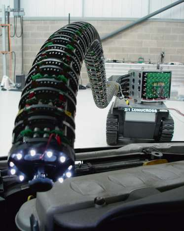

---

## Page 4

Introduction
• A robot’s end-effector moves in Cartesian space with a translational and
rotational velocity – a spatial velocity;
• However, that velocity is a consequence of the velocities of the individual
robot joints;
• This section introduces the relationship between the velocity of the joints
ሶ𝑞 and the spatial velocity 𝑣of the end-effector: the Jacobian matrix.
2

---

## Page 5

Introduction
• The Jacobian matrix can be used to compute:
❑Manipulability (Sec 8.1, 8.3);
❑Resolved-rate motion control (Sec 8.2);
❑Force-velocity Relationships (Sec 8.4);
❑Numerical Inverse Kinematics (Sec 8.5)
…among others.
2
Carl Gustav Jacob Jacobi (1804–1851) was 
a Prussian mathematician. Jacobi wrote a
classic treatise on elliptic functions in 1829
and
also
described
the
derivative
of
𝑚
functions of 𝑛variables which bears his name.
Not included 
in TEL200

### Images

#### Image 1 (Page 5)
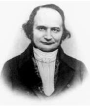

---

## Page 6

• A Jacobian is the matrix equivalent of the derivative – the derivative of a vector-valued function of a vector with 
respect to a vector. 
• If f : Rn →Rm, such that each of its first-order partial derivatives exists on R, then Jacobian matrix of f, 
denoted Jf ∈Rm×n, is defined as
Introduction – Jacobian matrix

### Images

#### Image 1 (Page 6)
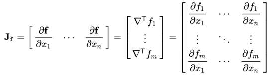

---

## Page 7

Manipulator Jacobian
• In the last chapter we discussed the relationship between joint coordinates
and end-effector pose – the manipulator kinematics;
2
𝝃𝑬=  𝒦(𝒒)
(1)

---

## Page 8

Manipulator Jacobian
• In the last chapter we discussed the relationship between joint coordinates
and end-effector pose – the manipulator kinematics;
• Now, we investigate the relationship between the rate of change of these
quantities – between joint velocity and velocity of the end-effector;
• This is called the velocity or differential kinematics of the manipulator.
2
𝝃𝑬=  𝒦(𝒒)
(1)
ሶ𝝃𝑬= 𝐽𝒒 ሶ𝒒
(2)

---

## Page 9

Overview of Ch. 7-8
Forward
Backward
q    Kinematics
𝝃
Joint space
Task space
Matrix multiplication, J(q)
Inverse, J-1(q)
ሶ𝒒
Jacobian
ሶ𝝃
Joint space velocity
Task space velocity

---

## Page 10

Overview of Ch. 7-8
Forward
Backward
q    Kinematics
𝝃
Joint space
Task space
Joint space velocity
Task space velocity
• Jacobian Matrix: Relationship between joint space velocity with task space velocity
• Physical Interpretation: How each individual joint space velocity contribute to task 
space velocity
• Question: When is the Jacobian not invertible?
Matrix multiplication, J(q)
Inverse, J-1(q)
ሶ𝒒
Jacobian
ሶ𝝃
Answer: at robot singularities

---

## Page 11

Jacobian in the World Coordinate Frame
• We illustrate the basics with our now familiar
2-dimensional example (Fig. 8.1), this time
defined using Denavit-Hartenberg notation;
>>> import sympy
$$
>>> a1, a2 = sympy.symbols("a1, a2")
$$
$$
>>> e = ERobot2(ET2.R() * ET2.tx(a1) * ET2.R() *
$$
ET2.tx(a2))
2
Fig.8.1:Two-link robot showing the end-effector position 
$$
𝑝= 𝑥, 𝑦and the Cartesian velocity vector 𝜈= 𝑑𝑝/𝑑𝑡.
$$

### Images

#### Image 1 (Page 11)

#### Image 2 (Page 11)

#### Image 3 (Page 11)

#### Image 4 (Page 11)

#### Image 5 (Page 11)

#### Image 6 (Page 11)

#### Image 7 (Page 11)

#### Image 8 (Page 11)

---

## Page 12

Jacobian in the World Coordinate Frame
• Define a symbolic 2-vector to represent the
joint angles
$$
>>> q = sympy.symbols("q:2")
$$
(q0, q1)
• The forward kinematics are
$$
>>> TE = e.fkine(q);
$$
The position vector of the robot end-effector
𝑝= 𝑥, 𝑦∈ℝ2 is given by
>>> p = TE.t
array([a1*cos(q0) + a2*cos(q0 + q1),
$$
a1*sin(q0) + a2*sin(q0 + q1)], dtype=object)
$$
2
Fig.8.1:Two-link robot showing the end-effector position 
$$
𝑝= 𝑥, 𝑦and the Cartesian velocity vector 𝜈= 𝑑𝑝/𝑑𝑡.
$$

### Images

#### Image 1 (Page 12)

#### Image 2 (Page 12)

#### Image 3 (Page 12)

#### Image 4 (Page 12)

#### Image 5 (Page 12)

#### Image 6 (Page 12)

#### Image 7 (Page 12)

#### Image 8 (Page 12)

#### Image 9 (Page 12)

#### Image 10 (Page 12)

#### Image 11 (Page 12)

#### Image 12 (Page 12)

#### Image 13 (Page 12)

#### Image 14 (Page 12)

---

## Page 13

Jacobian in the World Coordinate Frame
2
Fig.8.1:Two-link robot showing the end-effector position 
$$
𝑝= 𝑥, 𝑦and the Cartesian velocity vector 𝜈= 𝑑𝑝/𝑑𝑡.
$$
…and we compute the time-derivative of 𝑝
with respect to the joint variables 𝑞.
• Since 𝑝and 𝑞are both vectors the derivative:
will be a matrix – a Jacobian matrix:
[formula text unreadable from PDF encoding; see source PDF/image]
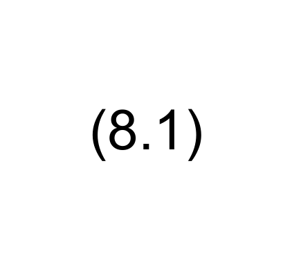

### Images

#### Image 1 (Page 13)

#### Image 2 (Page 13)

---

## Page 14

Jacobian in the World Coordinate Frame
2
Fig.8.1:Two-link robot showing the end-effector position 
$$
𝑝= 𝑥, 𝑦and the Cartesian velocity vector 𝜈= 𝑑𝑝/𝑑𝑡.
$$
…and we compute the time-derivative of 𝑝
with respect to the joint variables 𝑞.
• Since 𝑝and 𝑞are both vectors the derivative:
will be a matrix – a Jacobian matrix:
$$
>>> J = sympy.Matrix(p).jacobian(q)
$$
Matrix([[-a1*sin(q0)
-
a2*sin(q0
+
q1),
-
a2*sin(q0 + q1)],[ a1*cos(q0) + a2*cos(q0 + q1),
a2*cos(q0 + q1)]])
>>> J.shape
[formula text unreadable from PDF encoding; see source PDF/image]
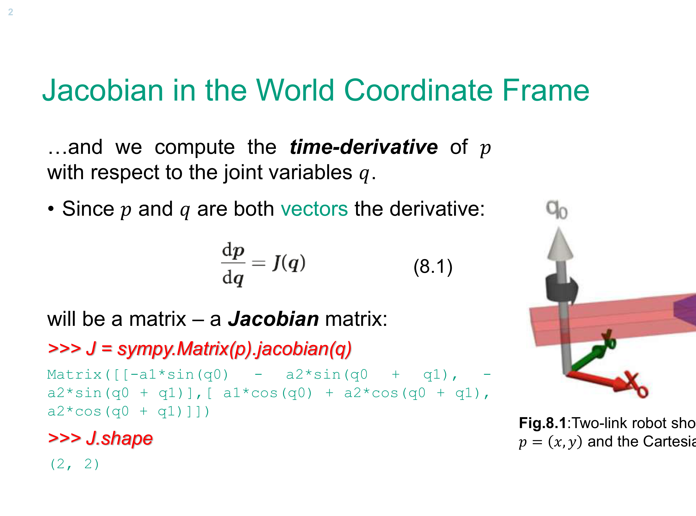

### Images

#### Image 1 (Page 14)
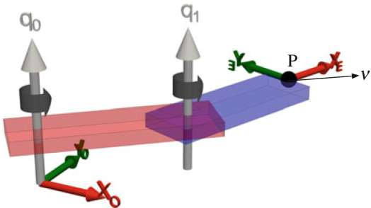

#### Image 2 (Page 14)

#### Image 3 (Page 14)

#### Image 4 (Page 14)

#### Image 5 (Page 14)

#### Image 6 (Page 14)

#### Image 7 (Page 14)

#### Image 8 (Page 14)

#### Image 9 (Page 14)

#### Image 10 (Page 14)

#### Image 11 (Page 14)

#### Image 12 (Page 14)

---

## Page 15

Jacobian in the World Coordinate Frame
• To determine the relationship between joint velocity and end-effector velocity 
we rearrange Eq. (8.1) as:
2
(4)
⇒

### Images

#### Image 1 (Page 15)
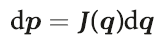

#### Image 2 (Page 15)
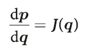

---

## Page 16

Jacobian in the World Coordinate Frame
• To determine the relationship between joint velocity and end-effector velocity 
we rearrange Eq. (8.1) as:
and divide through by 𝑑𝑡to obtain:
2
(4)
⇒
⇒
(5)

### Images

#### Image 1 (Page 16)

#### Image 2 (Page 16)

#### Image 3 (Page 16)
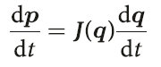

#### Image 4 (Page 16)
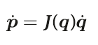

---

## Page 17

Jacobian in the World Coordinate Frame
• To determine the relationship between joint velocity and end-effector velocity 
we rearrange Eq. (8.1) as:
and divide through by 𝑑𝑡to obtain:
• The Jacobian matrix maps velocity from the joint coordinate or configuration
space to the end-effector’s coordinate or Cartesian space and is itself a
function of the joint coordinates.
2
(4)
⇒
⇒
(5)

### Images

#### Image 1 (Page 17)

#### Image 2 (Page 17)

#### Image 3 (Page 17)

#### Image 4 (Page 17)

---

## Page 18

Jacobian in the World Coordinate Frame
• More generally we write the forward kinematics in functional form as:
2

### Images

#### Image 1 (Page 18)

---

## Page 19

Jacobian in the World Coordinate Frame
• More generally we write the forward kinematics in functional form as:
and taking the time-derivative we write
where 0𝑣= 𝑣𝑥, 𝑣𝑦, 𝑣𝑧, 𝜔𝑥, 𝜔𝑦, 𝜔𝑧∈ℝ6 is the spatial velocity of the end-effector
in the world frame and comprises translational and rotational velocity
components.
2
[formula text unreadable from PDF encoding; see source PDF/image]
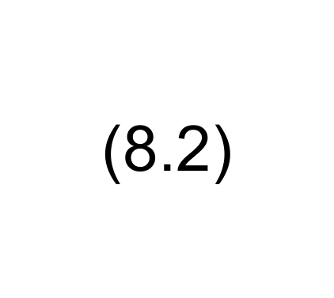

### Images

#### Image 1 (Page 19)

#### Image 2 (Page 19)
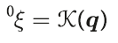

---

## Page 20

Jacobian in the World Coordinate Frame
• More generally we write the forward kinematics in functional form as:
and taking the time-derivative we write
The matrix 0𝐽= 𝑞∈ℝ6×𝑁is the manipulator Jacobian.
This relationship is sometimes referred to as the instantaneous forward
kinematics.
2
[formula text unreadable from PDF encoding; see source PDF/image]

### Images

#### Image 1 (Page 20)

#### Image 2 (Page 20)
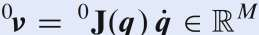

---

## Page 21

Jacobian in the World Coordinate Frame
• For a real 3-dimensional robot manipulator
this Jacobian matrix can be numerically
computed by the jacob0 method of any
Toolbox robot object, based on its Denavit-
Hartenberg (DH) parameters.
• For the UR5 robot in the pose shown in Fig. 
8.2, the Jacobian is 
$$
>>> ur5 = models.URDF.UR5();
$$
$$
>>> J = ur5.jacob0(ur5.q1)
$$
2
Fig.8.2: UR5 robot in joint configuration 𝑞1.The end-
effector 𝑧-axis points in the world 𝑥-direction.

### Images

#### Image 1 (Page 21)

#### Image 2 (Page 21)

#### Image 3 (Page 21)

---

## Page 22

Jacobian in the World Coordinate Frame
J =
array([[-0.02685, 0.3304, -0.09465, -0.09465, -0.0823, 0],
[ 0.4745,  0,       0,        0,       -0.0823, 0],
[ 0,      -0.4745, -0.4745,  -0.0823,   0,     -0.0823],
[formula text unreadable from PDF encoding; see source PDF/image]
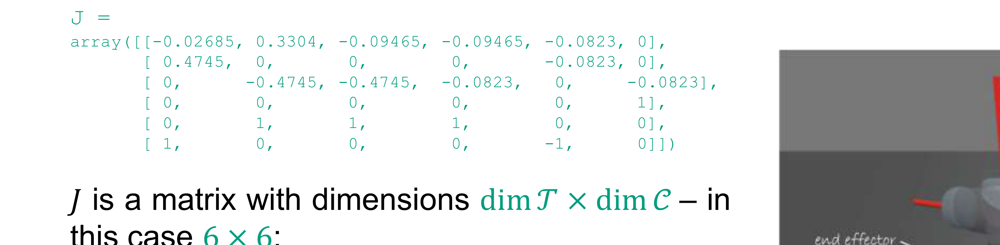
𝐽is a matrix with dimensions dim 𝒯× dim 𝒞– in
this case 6 × 6;
• Each row corresponds to a Cartesian degree
of freedom, while each column corresponds
to a joint degree of mobility.
2
Fig.8.2: UR5 robot in joint configuration 𝑞1.The end-
effector 𝑧-axis points in the world 𝑥-direction.

### Images

#### Image 1 (Page 22)
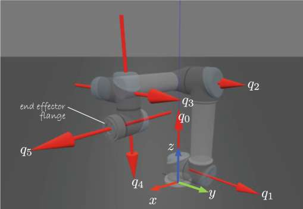

---

## Page 23

Jacobian in the World Coordinate Frame
J =
array([[-0.02685, 0.3304, -0.09465, -0.09465, -0.0823, 0],
[ 0.4745,  0,       0,        0,       -0.0823, 0],
[ 0,      -0.4745, -0.4745,  -0.0823,   0,     -0.0823],
[formula text unreadable from PDF encoding; see source PDF/image]
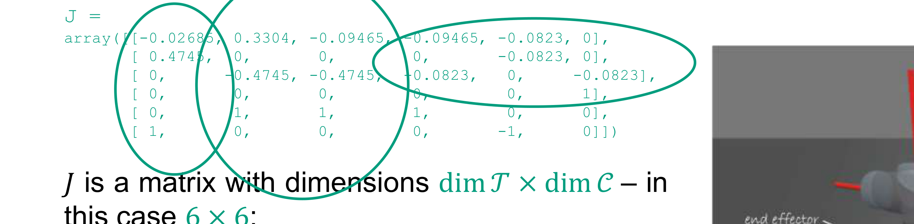
𝐽is a matrix with dimensions dim 𝒯× dim 𝒞– in
this case 6 × 6;
• Each row corresponds to a Cartesian degree
of freedom, while each column corresponds
to a joint degree of mobility.
2
Fig.8.2: UR5 robot in joint configuration 𝑞1.The end-
effector 𝑧-axis points in the world 𝑥-direction.

### Images

#### Image 1 (Page 23)

---

## Page 24

Jacobian in the End-effector Coordinate Frame
• The Jacobian matrix computed by the method jacob0 maps joint velocity to
the end-effector spatial velocity expressed in the world coordinate frame;
2

---

## Page 25

Jacobian in the End-effector Coordinate Frame
• The Jacobian matrix computed by the method jacob0 maps joint velocity to
the end-effector spatial velocity expressed in the world coordinate frame;
• To obtain the spatial velocity in the end-effector coordinate frame we
introduce the velocity transformation from the world frame {0} to the end-
effector frame {𝐸} which is a function of the end-effector pose (Ref. Sec 3.1.3):
2

---

## Page 26

Transforming Spatial Velocities - from Sec. 3.1.3
• The
velocity
of
a
moving
body
can
be
expressed with respect to a world reference
frame {𝐴} or the moving body frame {𝐵}
• Spatial velocities are linearly related by:
where
and
is a Jacobian 
or interaction matrix.
2
[formula text unreadable from PDF encoding; see source PDF/image]

### Images

#### Image 1 (Page 26)

#### Image 2 (Page 26)

#### Image 3 (Page 26)

#### Image 4 (Page 26)
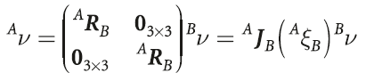

#### Image 5 (Page 26)
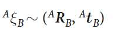

#### Image 6 (Page 26)
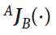

---

## Page 27

Jacobian in the End-effector Coordinate Frame
• Using Eq. (8.2)
we obtain
which results in a new Jacobian for end-effector velocity, denoted 𝐸𝐽(𝑞).
2
𝐸𝐽(𝑞)
[formula text unreadable from PDF encoding; see source PDF/image]
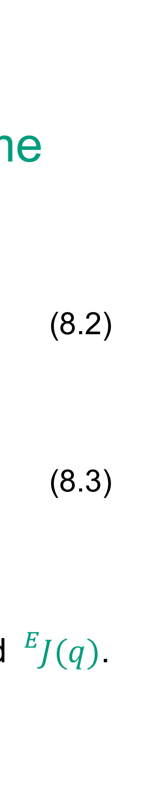

### Images

#### Image 1 (Page 27)
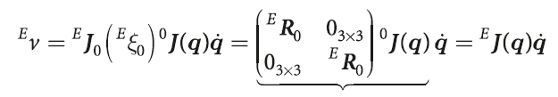

#### Image 2 (Page 27)

---

## Page 28

Jacobian in the End-effector Coordinate Frame
• In the Toolbox this Jacobian is computed by the method jacobe and for the
UR5 robot at the pose used above is:
>>> ur5.jacobe(ur5.q1)
array([[ -0.4745,  0,       0,       0,       0.0823, 0],
[ 0.02685, -0.3303,  0.09465, 0.09465, 0.0823, 0],
[formula text unreadable from PDF encoding; see source PDF/image]
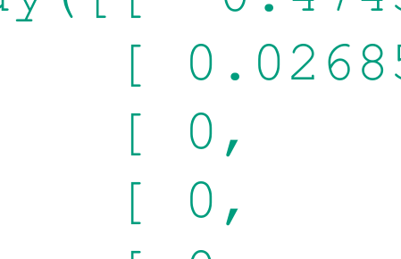
0.4746,  0.4745,  0.0823,  0,      0.0823],
[ 0,       -1,      -1,      -1,       0,      0],
[ 0,        0,       0,       0,       0,     -1],
2

### Images

#### Image 1 (Page 28)

#### Image 2 (Page 28)

#### Image 3 (Page 28)

#### Image 4 (Page 28)

#### Image 5 (Page 28)

#### Image 6 (Page 28)

#### Image 7 (Page 28)

#### Image 8 (Page 28)

#### Image 9 (Page 28)

#### Image 10 (Page 28)

---

## Page 29

Ch. 8.3 
Jacobian Condition and Manipulability

---

## Page 30

Jacobian Condition and Manipulability
• We have discussed how the Jacobian matrix maps joint rates to end-effector
Cartesian velocity;
• However, the inverse problem has strong practical use – what joint velocities
are needed to achieve a required end-effector Cartesian velocity?
2

---

## Page 31

Jacobian Condition and Manipulability
• We have discussed how the Jacobian matrix maps joint rates to end-effector
Cartesian velocity;
• However, the inverse problem has strong practical use – what joint velocities
are needed to achieve a required end-effector Cartesian velocity?
• We can invert the differential kinematics equation (8.2) and write:
provided that 𝑱is square and nonsingular (i.e., det(𝐽) ≠0);
2
[formula text unreadable from PDF encoding; see source PDF/image]
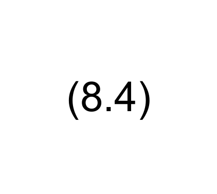

### Images

#### Image 1 (Page 31)
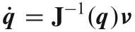

---

## Page 32

Jacobian Singularities
$$
• A robot configuration 𝑞at which det(𝑱(𝑞)) = 0 is described as singular or
$$
degenerate.
• Singularities occur when the robot is at maximum reach or when one or more
axes become aligned resulting in the loss of degrees of freedom – the gimbal
lock problem again.
2

---

## Page 33

Jacobian Singularities
• Singularities can be classified into:
❑Boundary singularities: that occur when the manipulator is either outstretched
or retracted;
It is also known as arm singularities…
2

---

## Page 34

Jacobian Singularities
• Singularities can be classified into:
❑Boundary singularities: that occur when the manipulator is either outstretched
or retracted;
It is also known as arm singularities…
❑Internal singularities: that occur inside the reachable workspace and are
generally caused by the alignment of two or more axes of motion;
It is also known as wrist singularities…
2

---

## Page 35

Jacobian Singularities
• Arm and wrist singularities:
2
Two-link planar arm at a boundary singularity [2].
Spherical wrist at a singularity [2].

### Images

#### Image 1 (Page 35)
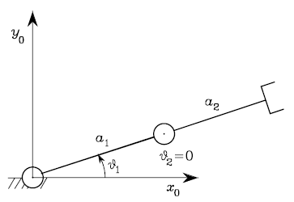

#### Image 2 (Page 35)
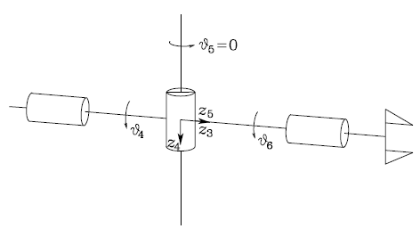

---

## Page 36

Jacobian Singularities
$$
• A robot configuration 𝑞at which det(𝑱(𝑞)) = 0 is described as singular or
$$
degenerate.
• Singularities occur when the robot is at maximum reach or when one or more
axes become aligned resulting in the loss of degrees of freedom – the gimbal
lock problem again.
• For example, at the UR5 robot at its zero configuration has a Jacobian
$$
>>> J = ur5.jacob0(ur5.qz)
$$
which is singular…
2

### Images

#### Image 1 (Page 36)

#### Image 2 (Page 36)

#### Image 3 (Page 36)

#### Image 4 (Page 36)

#### Image 5 (Page 36)

#### Image 6 (Page 36)

#### Image 7 (Page 36)

#### Image 8 (Page 36)

#### Image 9 (Page 36)

#### Image 10 (Page 36)

#### Image 11 (Page 36)

---

## Page 37

Jacobian Singularities
$$
J = array([[-0.1915, -0.09465, -0.09465, -0.09465, 0.0823, 0],
$$
[ 0.8996,  0,        0,        0,      -0.0823, 0],
[ 0,      -0.8996,  -0.4746,  -0.0823,  0,     -0.0823],
[formula text unreadable from PDF encoding; see source PDF/image]
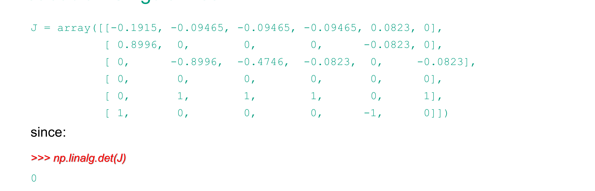
since:
>>> np.linalg.det(J)
0
2

### Images

#### Image 1 (Page 37)

#### Image 2 (Page 37)

#### Image 3 (Page 37)

---

## Page 38

Jacobian Singularities
• We can also see that the Jacobian rank is only
>>> np.linalg.matrix_rank(J)
5
• The function jsingu performs this analysis automatically, for example
>>> jsingu(J)
column 3 = - 0.923 column_1 + 1.92 column_2
indicating that velocity of 𝑞3 can be expressed completely in terms of the
velocities of 𝑞1 and 𝑞2.
• This means that joint 3 is not needed, and the robot has only 5 effective joints
2

### Images

#### Image 1 (Page 38)

#### Image 2 (Page 38)

#### Image 3 (Page 38)

#### Image 4 (Page 38)

#### Image 5 (Page 38)

#### Image 6 (Page 38)

---

## Page 39

Jacobian Singularities
• However, if the robot is close to, but NOT actually at, a singularity we
encounter problems where some Cartesian end-effector velocities require
very high joint rates – at the singularity those rates will go to infinity;
2

---

## Page 40

Jacobian Singularities
• However, if the robot is close to, but NOT actually at, a singularity we
encounter problems where some Cartesian end-effector velocities require
very high joint rates – at the singularity those rates will go to infinity;
• We can illustrate this by choosing a configuration slightly away from 𝑞z which
we just showed was singular;
2

---

## Page 41

Jacobian Singularities
• However, if the robot is close to, but NOT actually at, a singularity we
encounter problems where some Cartesian end-effector velocities require
very high joint rates – at the singularity those rates will go to infinity;
• We can illustrate this by choosing a configuration slightly away from 𝑞z which
we just showed was singular;
• We set all joints to a small but nonzero value of 5 deg
$$
>>> qns = np.full((6,), np.deg2rad(5))
$$
array([ 0.08727, 0.08727, 0.08727, 0.08727, 0.08727, 0.08727])
2

### Images

#### Image 1 (Page 41)

#### Image 2 (Page 41)

#### Image 3 (Page 41)

#### Image 4 (Page 41)

#### Image 5 (Page 41)

---

## Page 42

Jacobian Singularities
…and the Jacobian matrix is now
$$
>>> J = ur5.jacob0(qns);
$$
• To achieve relatively slow end-effector motion of 0.1 𝑚𝑠−1 in the 𝑧-direction
requires
$$
>>> qd = np.linalg.inv(J) @ [0, 0, 0, 0.1, 0, 0]
$$
array([-0.003797, -2.773, 5.764, -4.088, -0.02945, 1.093])
2

### Images

#### Image 1 (Page 42)

#### Image 2 (Page 42)

#### Image 3 (Page 42)

#### Image 4 (Page 42)

---

## Page 43

Jacobian Singularities
…a very high-speed motion of many joints – the velocity of joint 2 is nearly 1
revolution /s, or 50 times greater than the required task space rotation rate!
2

---

## Page 44

Jacobian Singularities
…a very high-speed motion of many joints – the velocity of joint 2 is nearly 1
revolution /s, or 50 times greater than the required task space rotation rate!
• The reason is that although the robot is NO longer at a singularity, the
determinant of the Jacobian is still very small:
>>> np.linalg.det(J)
-0.0009943
• The closer we get to the singularity the higher the joint rates will be – at the 
singularity those rates will go to infinity.
2

### Images

#### Image 1 (Page 44)

#### Image 2 (Page 44)

#### Image 3 (Page 44)

---

## Page 45

Jacobian Singularities
• Alternatively, we can say that its condition number is very high
>>> np.linalg.cond(J)
232.1
and the Jacobian is poorly conditioned.
2

### Images

#### Image 1 (Page 45)

#### Image 2 (Page 45)

#### Image 3 (Page 45)

---

## Page 46

Manipulability
• Consider the set of generalized joint velocities with a unit norm
which lie on the surface of a hypersphere in the 𝑁-dimensional joint velocity
space.
2
(17)

### Images

#### Image 1 (Page 46)

---

## Page 47

Manipulability
• Consider the set of generalized joint velocities with a unit norm
which lie on the surface of a hypersphere in the 𝑁-dimensional joint velocity
space.
$$
• Substituting Eq. (8.4) ( ሶ𝑞= 𝐽𝑞𝑣) into (*) we get
$$
which is the equation of points v on the surface of a hyper-ellipsoid within the
dim 𝒯-dimensional task-velocity space;
2
(*)
[formula text unreadable from PDF encoding; see source PDF/image]
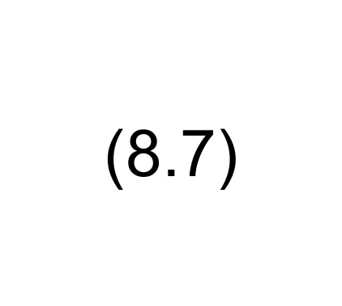

### Images

#### Image 1 (Page 47)
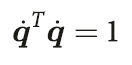

#### Image 2 (Page 47)
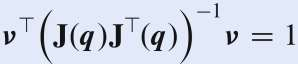

---

## Page 48

Manipulability
• If this ellipsoid is close to spherical, that is, its
radii are of the same order of magnitude then
all is doing well – the end-effector CAN achieve
arbitrary Cartesian velocity;
2
Fig.: Velocity manipulability ellipses for a
2-link planar arm in different postures [2].

### Images

#### Image 1 (Page 48)

---

## Page 49

Manipulability
• If this ellipsoid is close to spherical, that is, its
radii are of the same order of magnitude then
all is doing well – the end-effector CAN achieve
arbitrary Cartesian velocity;
• However, if one or more radii are very small
this indicates that the end-effector CANNOT
achieve velocity in the directions corresponding
to those small radii.
2
Fig.: Velocity manipulability ellipses for a
2-link planar arm in different postures [2].

### Images

#### Image 1 (Page 49)
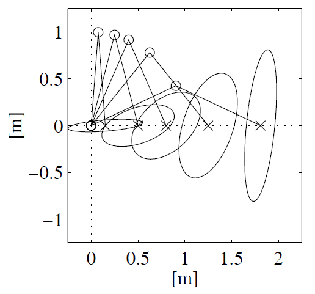

#### Image 2 (Page 49)

#### Image 3 (Page 49)

#### Image 4 (Page 49)

#### Image 5 (Page 49)

#### Image 6 (Page 49)

---

## Page 50

Manipulability
• The size and shape of the ellipsoid describes how well-conditioned the
manipulator is for making certain motions;
• Manipulability is a scalar measure that describes how spherical the ellipsoid
is, for instance the ratio of the smallest to the largest radius;
• The Toolbox method manipulability computes Yoshikawa’s manipulability
measure as:
which is proportional to the volume of the ellipsoid.
2
[formula text unreadable from PDF encoding; see source PDF/image]
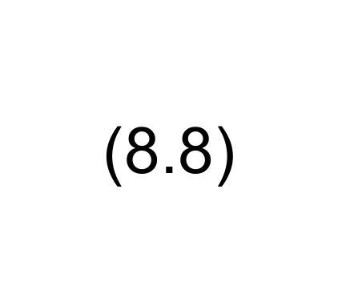

### Images

#### Image 1 (Page 50)
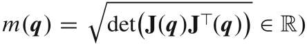

---

## Page 51

Manipulability
• For example, 
>>> ur5.manipulability(ur5.qz)
0
indicates a singularity. Compared to: 
>>> ur5.manipulability(ur5.q1)
0.06539
2

### Images

#### Image 1 (Page 51)

#### Image 2 (Page 51)

---

## Page 52

Manipulability
• The method can be called with axes parameter ("trans", "rot" or "both") 
$$
>>> ur5.manipulability(ur5.qz, axes="both")
$$
Manipulability: translation 0.00017794, rotation 0
(0.105, 2.449e-16)
2
Rotational 
manipulability

### Images

#### Image 1 (Page 52)

---

## Page 53

Manipulability
• The method can be called with axes parameter ("trans", "rot" or "both") 
$$
>>> ur5.manipulability(ur5.qz, axes="both")
$$
(0.105, 2.449e-16)
• In practice we find that the seemingly large workspace of a robot is greatly 
reduced by joint limits, self collision, singularities and regions of low manipulability
2
Rotational 
manipulability

### Images

#### Image 1 (Page 53)

---

## Page 54

Wrapping up…
• Jacobians are an important concept in robotics, relating changes in one space
to changes in another;
• The manipulator Jacobian which describes the relationship between the rate
of change of joint coordinates and the spatial velocity of the end-effector
expressed in either the world frame or the end-effector frame;
• The numerical properties of the Jacobian tell us about manipulability, that is
how well the manipulator is able to move, or exert force, in different directions;
• At a singularity, indicated by linear dependence between columns of the
Jacobian, the robot is unable to move in certain directions;
5

---

## Page 55

Bibliography
[1] Corke, P., Robotics, Vision and Control: Fundamental Algorithms in
Pythin, Springer International Publishing AG, 3rd Ed., 2023.
[2] Siciliano, B., Sciavicco, Villani, L. & Oriolo, G., Robotics: Modeling, 
Planning and Control, Springer-Verlag London Limited, 2nd Ed., 2009.
5

---

## Page 56

Thank you for your attention !

---
