# TEL200_Ch_1

Source PDF: TEL200_Ch_1.pdf

## Page 1

---

## Page 2

TEL200 – Introduction to Robotics
David A. Anisi
Lecture 1: Introduction and overview

---

## Page 3

TEL200 Introduction to Robotics
• TEL200 is a project-/ gathering-based course
• Lectures/Exercises:
Three gatherings (Samling 1-3)
TF4-102
• Project/lab:
Tuesdays 
14.15-18.00 
TF4-102
Thursdays
12.15-14.00
TF4-102
• Teachers:
– david.anisi@nmbu.no
(Course responsible, lectures) 
– ilwaad.hassan.mahamed@nmbu.no
(YuMi project)
– ludvik.hoibjerg-aslaksen@nmbu.no 
(Excercises + WalkingRobot)
– mikkel.einvik.stryker@nmbu.no
(Lab. engineer)
Norwegian University of Life Sciences
2

### Images

#### Image 1 (Page 3)
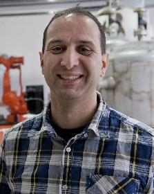

#### Image 2 (Page 3)
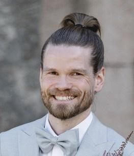

#### Image 3 (Page 3)
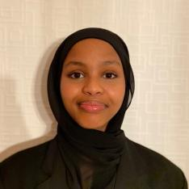

#### Image 4 (Page 3)

---

## Page 4

• Course content contd.
– Mobile robots
– Navigation
– Localization and mapping
• Course material
– RVC 3rd Ed. + QUT Robot Academy 
+ lecture notes + files on Canvas
• Course content
– Coordinate systems
– Time and motion
– Robot programming (RS/Python)
– Sensors, perception, vision & robot 
learning
– Manipulator- and differential 
kinematics
Norwegian University of Life Sciences
3
TEL200 Introduction to Robotics

### Images

#### Image 1 (Page 4)
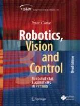

---

## Page 5

TEL200 Introduction to Robotics
• Learning outcomes
1.
Wide introduction and peek into the magic world of Robotics!!
2.
Develop a broad understanding of fundamental principles and problems in 
Robotics and provide a foundation for further studies of the different topics in 
greater depth in other, more specialized courses (T-competancy)
3.
Acquired knowledge about, and skills in, design, analysis and the application 
of robots
4.
Combine theory with practice: experiment with programming of real robots
5.
Understand basic concepts of Robotic Vision and Learning
Norwegian University of Life Sciences
4

### Images

#### Image 1 (Page 5)
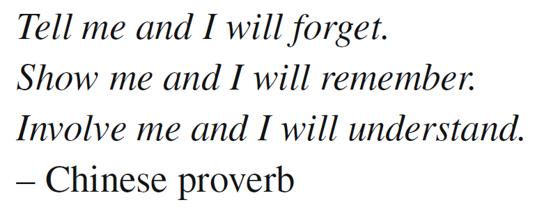

---

## Page 6

TEL200 Introduction to Robotics
• Learning activities and assessments (nominal workload, approx. 250 hrs.)
– Lectures and exercises in accordance with detailed schedule (see also Canvas)
– Self-study (reading, videos, pods)
– No Exam! Final grade (A-E/F) based on the following mandatory deliveries
– Compulsory labs/projects. Grade: A-E/F
Norwegian University of Life Sciences
5
Module
Type
Starts
Due
Delivery requirements
Grade
RobotStudio + 
YuMi lab (60%)
Oral Presentation 
(10 min)
29 Jan.
23 Mars
PPT files & videos (max 3 min)
P/F
File submission 
29 Jan.
23 Mars
PDF report (max 10 pages) + 
video (3 min) + RS Pack&Go
0-60 p 
Walking Robot 
[formula text unreadable from PDF encoding; see source PDF/image]

File submission
24 Mars
30 April
PDF report (max 10 pages) + 
video (3 min)  + py-files
0-40 p

---

## Page 7

Norwegian University of Life Sciences
6
Course time-line

### Images

#### Image 1 (Page 7)
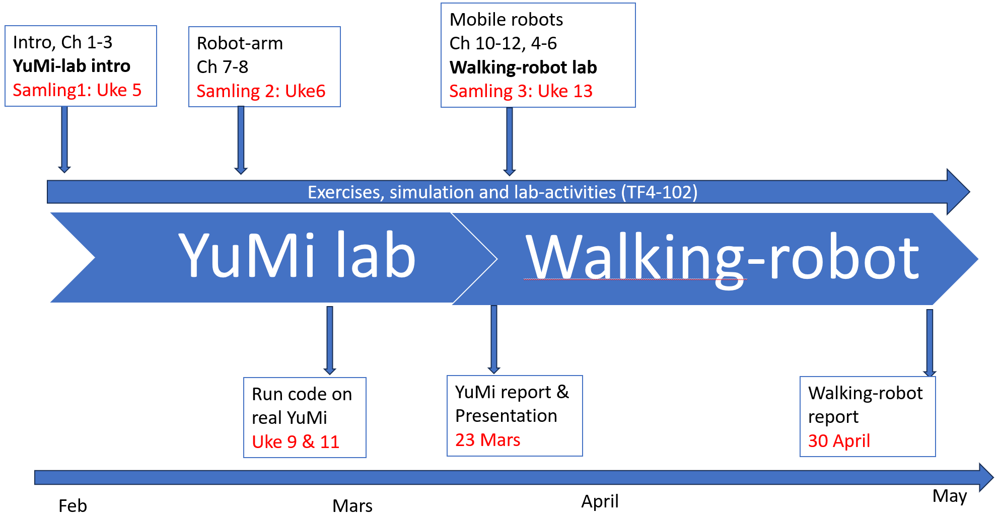

---

## Page 8

Norwegian University of Life Sciences
7
Course schedule

### Images

#### Image 1 (Page 8)
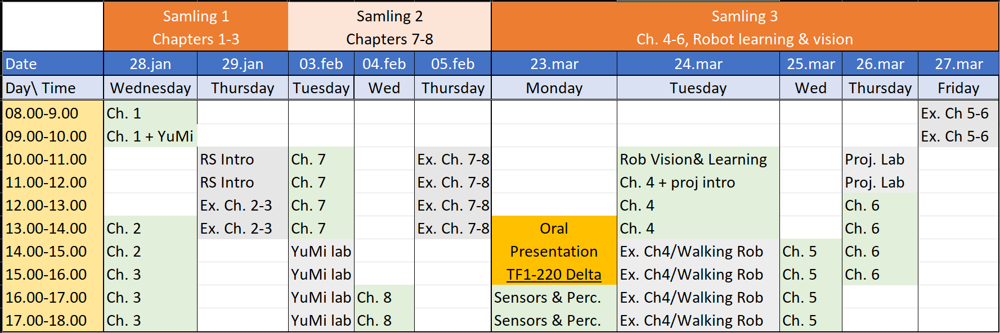

---

## Page 9

Second hour
• Grand challenges and fundamental 
problems in robotics -> course content
• Ethics in robotics (discussion groups)
• State of the art (videos)
First hour
• Course overview and info
• What is a robot? (discussion groups)
• Brief history of robotics (Ch. 1)
• Evolution of selected robotic sub-
domains (videos)
Norwegian University of Life Sciences
8
Agenda

---

## Page 10

Norwegian University of Life Sciences
9
What is a robot?

### Images

#### Image 1 (Page 10)

#### Image 2 (Page 10)
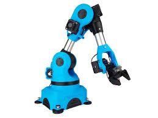

#### Image 3 (Page 10)
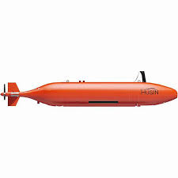

#### Image 4 (Page 10)

#### Image 5 (Page 10)
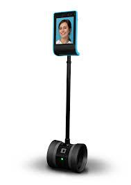

#### Image 6 (Page 10)
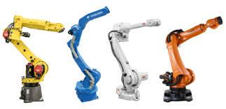

#### Image 7 (Page 10)
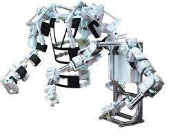

#### Image 8 (Page 10)

#### Image 9 (Page 10)
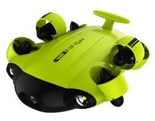

#### Image 10 (Page 10)
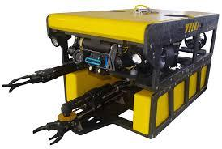

#### Image 11 (Page 10)
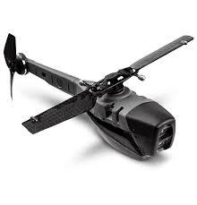

#### Image 12 (Page 10)
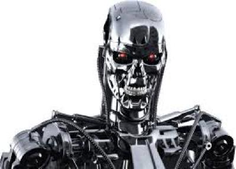

#### Image 13 (Page 10)

#### Image 14 (Page 10)
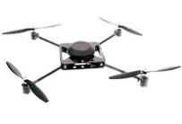

#### Image 15 (Page 10)

#### Image 16 (Page 10)
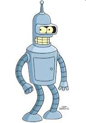

---

## Page 11

• "Robot" originates from 1920 Czech 
sience fiction play “Rossum’s Universal 
Robots” (R.U.R), by Karel Čapek.
• A goal-oriented machine that can sense, 
plan and act (autonomously)
• Exteroceptive- and proprioceptive sensors
Norwegian University of Life Sciences
10
What is a robot?
Plan
Act
Sense

### Images

#### Image 1 (Page 11)
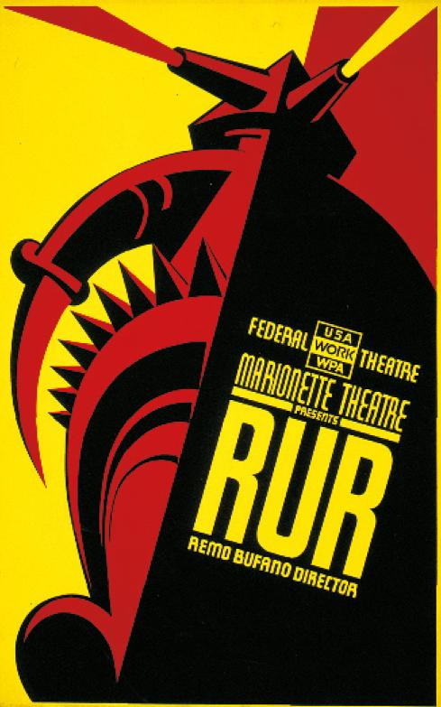

---

## Page 12

Brief history of robotics
• Karakuri Ningyo, Japan (1700s ~ )
• Traditional Japenese mechanized 
automata
Norwegian University of Life Sciences
11

### Images

#### Image 1 (Page 12)
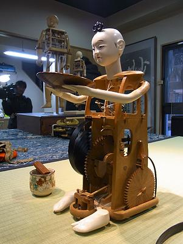

#### Image 2 (Page 12)
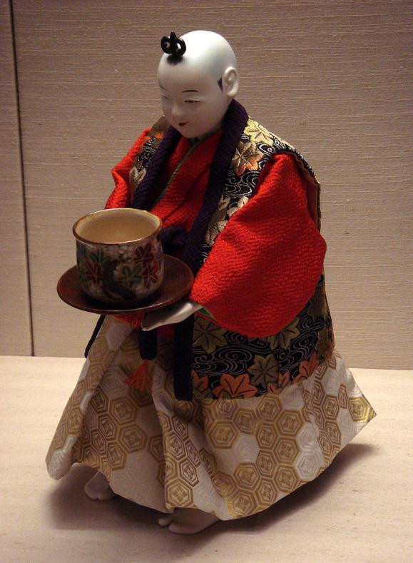

---

## Page 13

Brief history of robotics
• Vaucanson’s duck (1739)
• Early programmable machine
• Automaton that could flap its wings, eat 
grain and defecate.
Norwegian University of Life Sciences
12

### Images

#### Image 1 (Page 13)
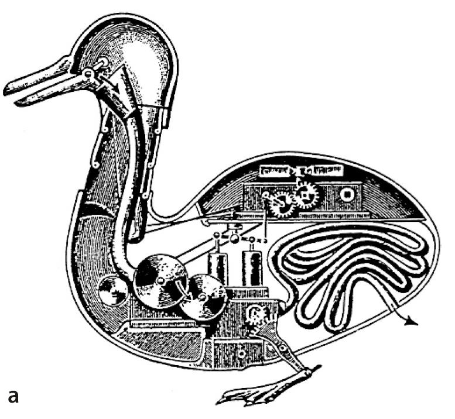

---

## Page 14

Brief history of robotics
• Mechanical Turk, Hungary (1770s ~ )
• Early programmable machine
• Automaton Chess Player (fake)
• Won against Napoleon Bonaparte in 
1809
• See video
Norwegian University of Life Sciences
13

### Images

#### Image 1 (Page 14)
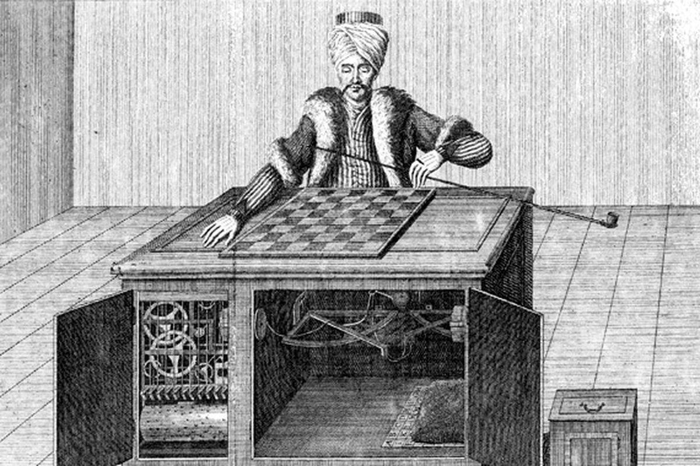

---

## Page 15

Brief history of robotics
• The Jacquard loom (1801)
• Re-programmable machine
• Program stored on punched cards
Norwegian University of Life Sciences
14

### Images

#### Image 1 (Page 15)
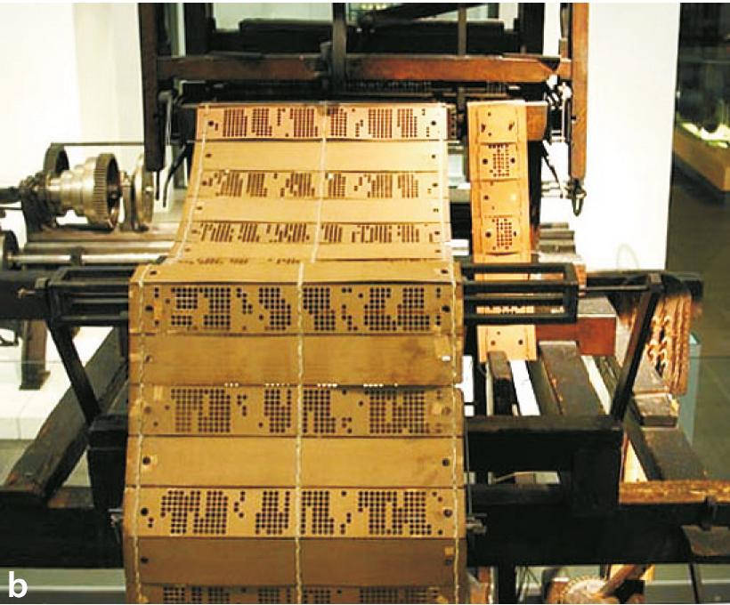

---

## Page 16

Brief history of robotics
• Developed by Raymond Goertz in 1954
• Used for remote handling of hazardous 
material 
• Teleoperation: Master-slave
• Viewed the operation through lead-
glass window or via a television link
• Force feedback
Norwegian University of Life Sciences
15
Image courtesy: Argonne National Laboratory

### Images

#### Image 1 (Page 16)
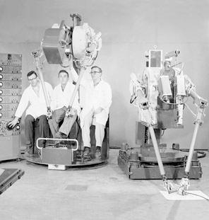

---

## Page 17

Brief history of robotics
• Unimation Inc.: worlds first robotics 
company
• Founded by George Devol and Joseph 
Engelberger in 1956
• Puma (Programmable Universal 
Machine Manipulation Arm), based on 
Stanford Arm (1969) is the first robotic 
manipulator arm with a closed form for 
inverse kinematics
Norwegian University of Life Sciences
16

### Images

#### Image 1 (Page 17)
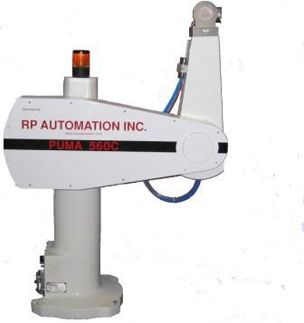

---

## Page 18

Brief history of robotics
• Unimation Inc.: worlds first robotics 
company
• Founded by George Devol and Joseph 
Engelberger in 1956
Norwegian University of Life Sciences
17

### Images

#### Image 1 (Page 18)
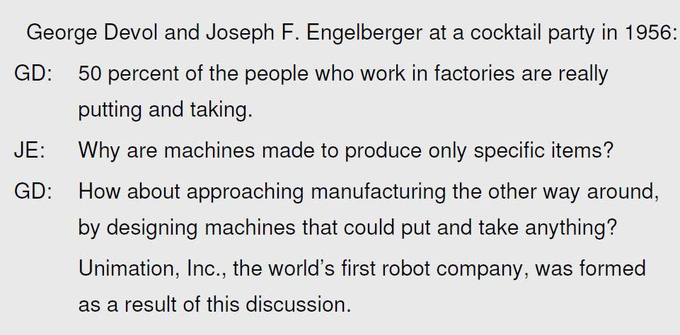

#### Image 2 (Page 18)

---

## Page 19

Brief history of robotics
• Worlds first painting robot
• ABB Robotics (Trallfa), 1964- 1969
• Developed by Ole Molaug and 
collegues from Bryne, Norway.
• Molaug also invented world's first 
centralized feeding system for farmed 
fish in 1979
Norwegian University of Life Sciences
18

### Images

#### Image 1 (Page 19)
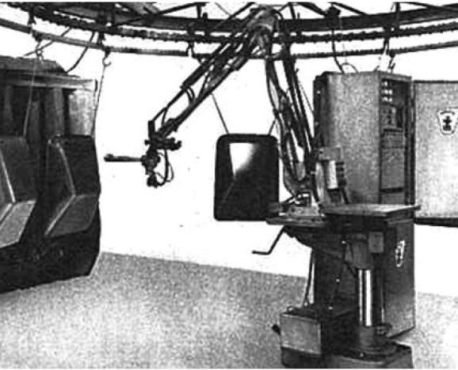

#### Image 2 (Page 19)
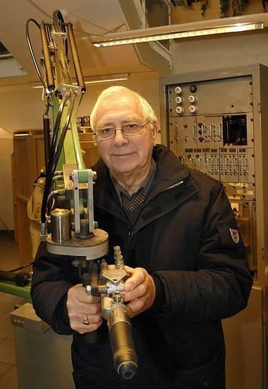

---

## Page 20

Brief history of robotics
• World’s first commercially available all 
electric micro-processor controlled robot
• IRB6, ABB Robotics (ASEA), 1973
Norwegian University of Life Sciences
19

### Images

#### Image 1 (Page 20)
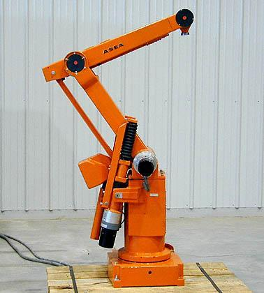

---

## Page 21

Brief history of robotics
• Wabot
• Waseda (1973)
Norwegian University of Life Sciences
20

### Images

#### Image 1 (Page 21)
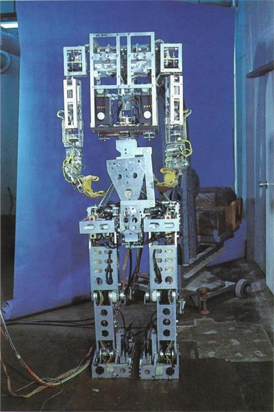

---

## Page 22

Brief history of robotics
• Berkeley 'Jason'
• Mobile autonomous robot (1974)
Norwegian University of Life Sciences
21

### Images

#### Image 1 (Page 22)
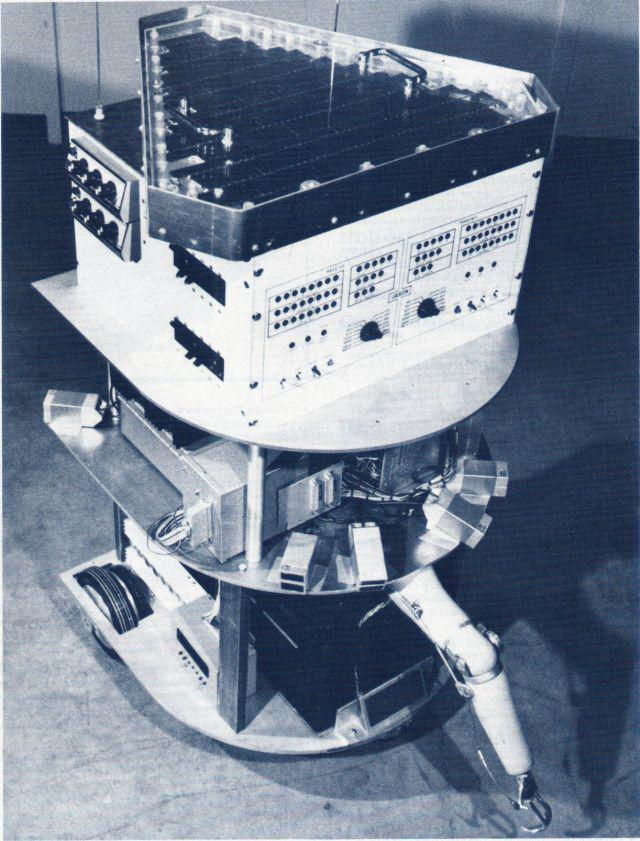

---

## Page 23

Brief history of robotics
• Nintendo 'Chiritorii' (1979)
• Remote controlled vacuum clearner
• Opens up service-robot market
Norwegian University of Life Sciences
22

### Images

#### Image 1 (Page 23)
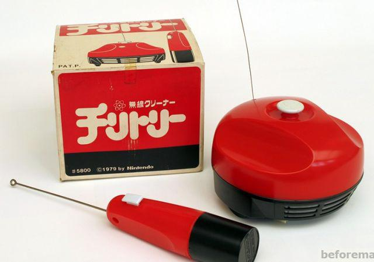

---

## Page 24

Brief history of robotics
• Omnidirectional robot (1980)
Norwegian University of Life Sciences
23

### Images

#### Image 1 (Page 24)
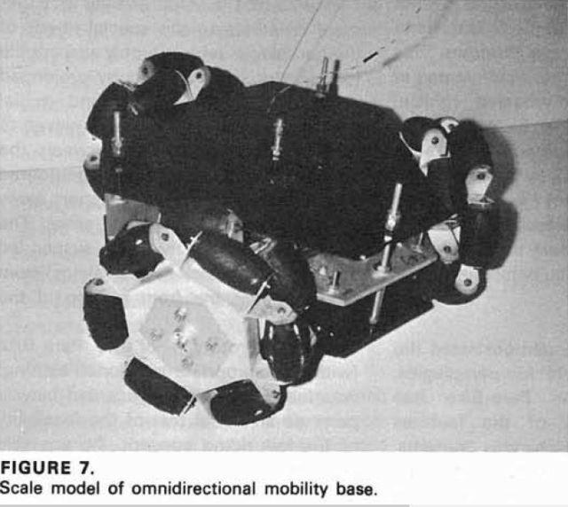

---

## Page 25

Brief history of robotics
Norwegian University of Life Sciences
24
• Ernst Dickmanns (VaMoRs), 1986, vision-based autonomous (95%) driving

### Images

#### Image 1 (Page 25)
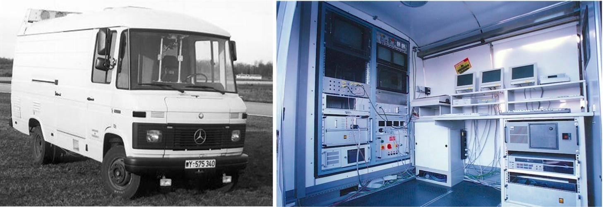

---

## Page 26

Brief history of robotics
• Robot table tennis, Russell Andersson 
(MIT), 1988
Norwegian University of Life Sciences
25

### Images

#### Image 1 (Page 26)
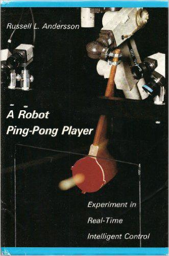

---

## Page 27

Brief history of robotics
• Electrolux 'Trilobite’, 1997
Norwegian University of Life Sciences
26

### Images

#### Image 1 (Page 27)
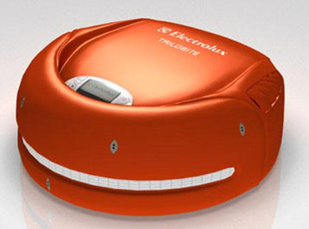

---

## Page 28

Brief history of robotics
• Draganflyer, Christine and Zenon 
Dragan (1999)
Norwegian University of Life Sciences
27

### Images

#### Image 1 (Page 28)
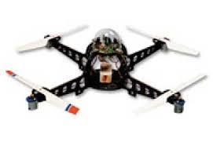

#### Image 2 (Page 28)
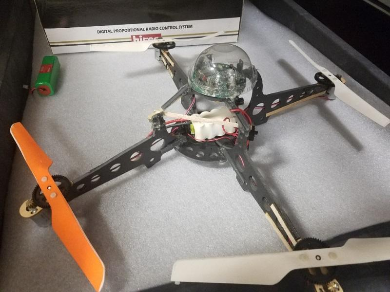

---

## Page 29

Brief history of robotics
• Cobots: safe, light-weight, F/T sensor
• DLR Light-weight robots, 1991-
• Realizing dream of 1:1 payload to mass 
ratio
Norwegian University of Life Sciences
28
I: 1991-1996     II: 1998-2002       III: 2003 (14/14)
Kuka LBR (2004)    Universal Robotics UR5 (2008)         Rethink Robotics, Baxter (2012)                 ABB Yumi (2015)

### Images

#### Image 1 (Page 29)
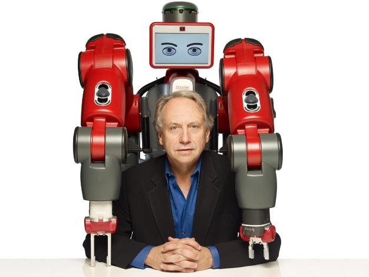

#### Image 2 (Page 29)
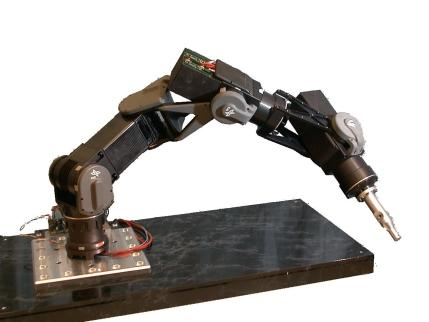

#### Image 3 (Page 29)
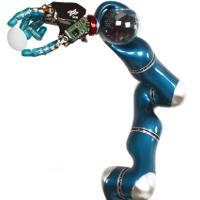

#### Image 4 (Page 29)
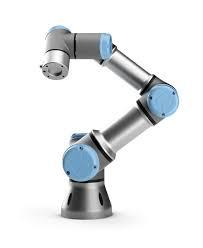

#### Image 5 (Page 29)
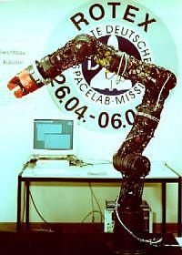

#### Image 6 (Page 29)
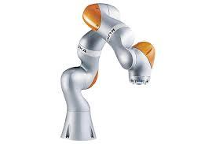

#### Image 7 (Page 29)
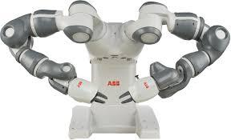

---

## Page 30

• Stationary - Mobile
• Teleoperation (ROV) – Autonomous (AV)
• Drones: Fixed wing – Quadrotors
• Field Robots
Aerial – Ground - Surface – Underwater
• Manufacturing – Service
• Robotic Manipulator - Cobots
• Humanoids
Norwegian University of Life Sciences
29
Robot taxonomy

### Images

#### Image 1 (Page 30)
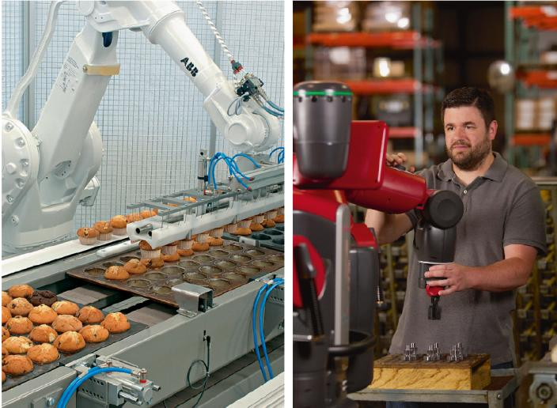

#### Image 2 (Page 30)
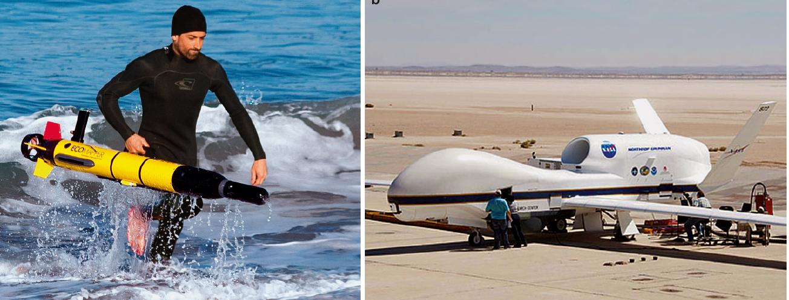

---

## Page 31

50 year challenge I
Birth of AI (1956) to AlphaGo (2015)
Norwegian University of Life Sciences
30

### Images

#### Image 1 (Page 31)
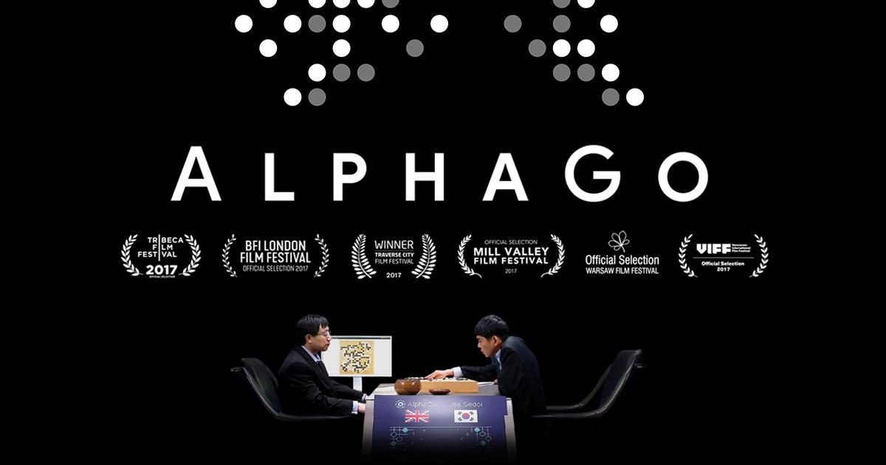

#### Image 2 (Page 31)
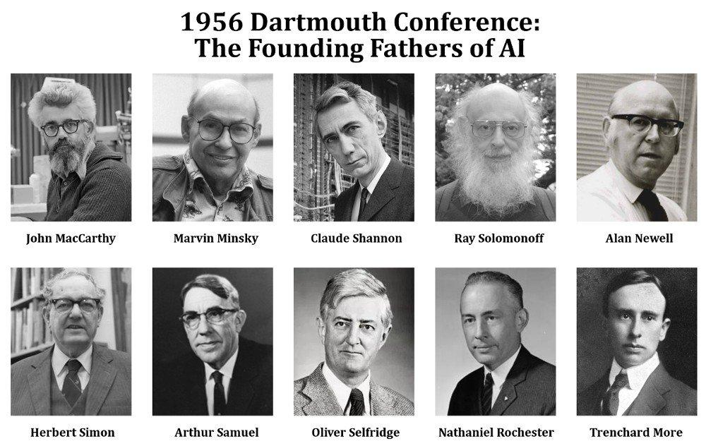

---

## Page 32

Norwegian University of Life Sciences
31
50 year challenge II
Man on the moon (1969) to Curiosity Rover (2013) or Mars (2029)?

### Images

#### Image 1 (Page 32)
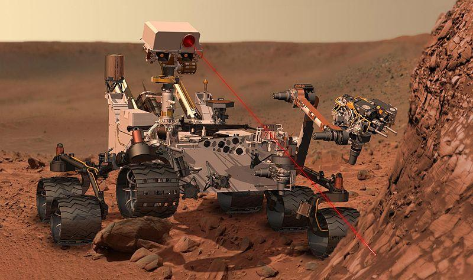

#### Image 2 (Page 32)
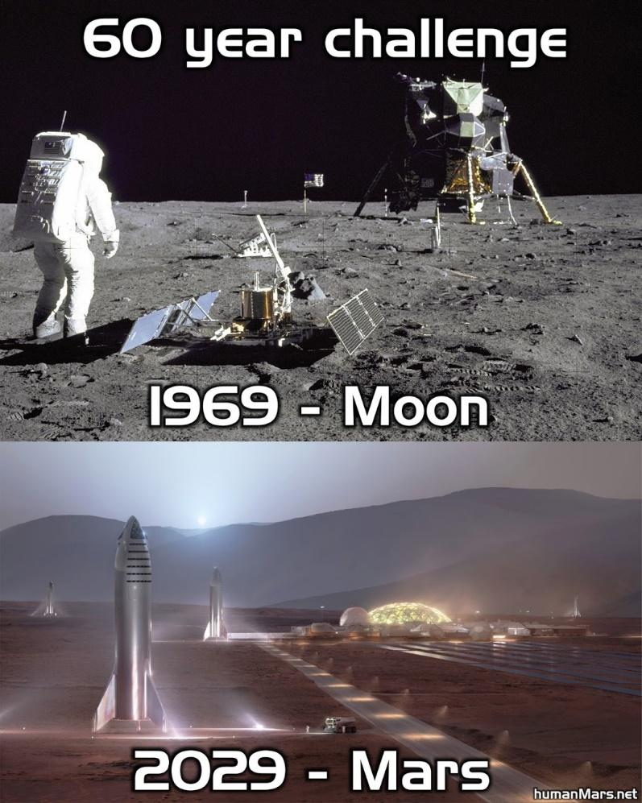

---

## Page 33

50 year challenge III ?
Robotic Agriculture
Norwegian University of Life Sciences
32

### Images

#### Image 1 (Page 33)
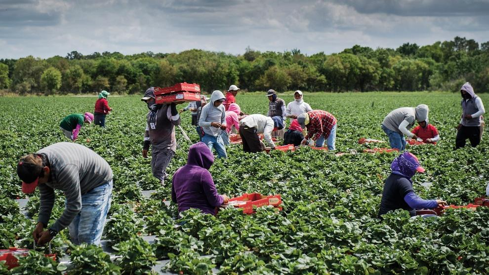

#### Image 2 (Page 33)
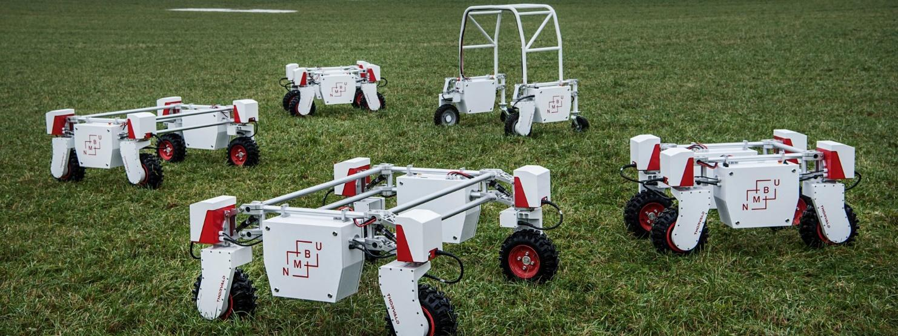

---

## Page 34

50 year challenge IV
RoboCup 
Norwegian University of Life Sciences
33
By mid-21st century, a team of fully autonomous humanoid robot soccer players 
shall win the soccer game, complying with the official rule of the FIFA, against the 
winner of the most recent World Cup (1997)

### Images

#### Image 1 (Page 34)
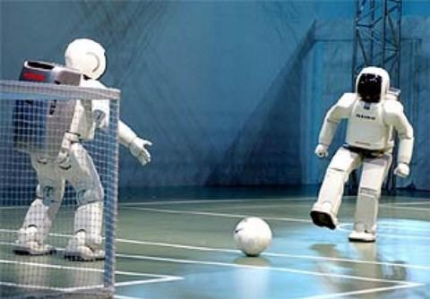

#### Image 2 (Page 34)
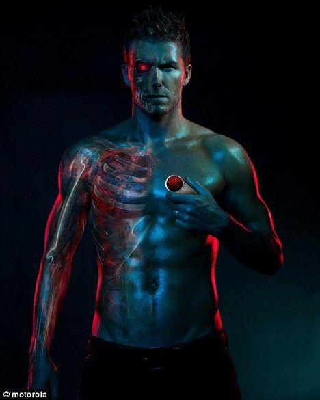

#### Image 3 (Page 34)
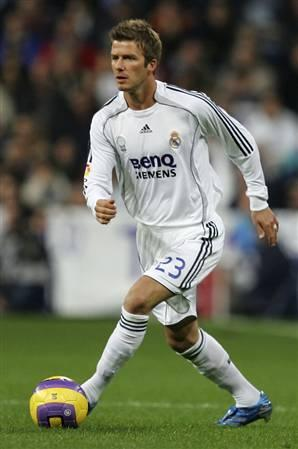

---

## Page 35

Norwegian University of Life Sciences
34
50 year challenge IV?
RoboCup

### Images

#### Image 1 (Page 35)
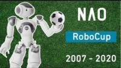

#### Image 2 (Page 35)
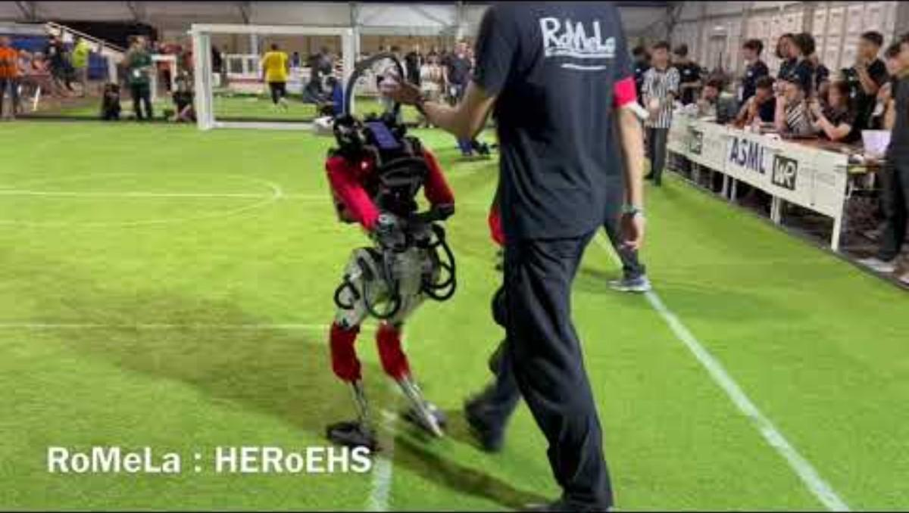

---

## Page 36

Norwegian University of Life Sciences
35
Robotic Evolution – Humanoid - Asimo

### Images

#### Image 1 (Page 36)
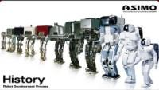

---

## Page 37

Norwegian University of Life Sciences
36
Robotic Evolution – Humanoid - Atlas
Hydraulic Atlas (until 2024)
All new full electric Atlas (2024)

### Images

#### Image 1 (Page 37)
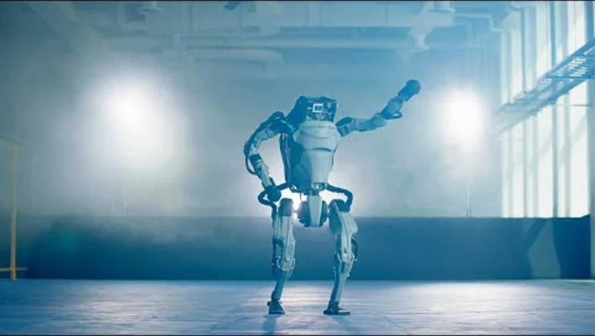

#### Image 2 (Page 37)
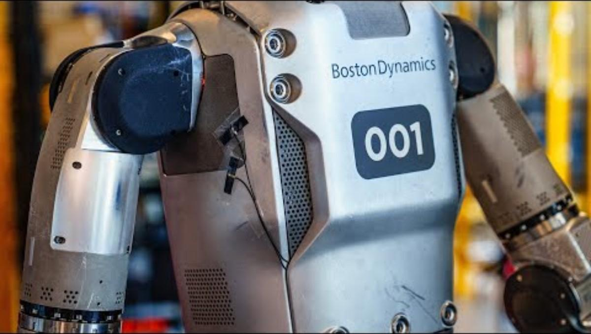

---

## Page 38

Norwegian University of Life Sciences
37
Robotic Evolution – Drones

### Images

#### Image 1 (Page 38)
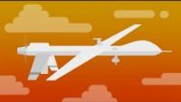

---

## Page 39

Norwegian University of Life Sciences
38
Robotic Evolution – Self-driving cars

### Images

#### Image 1 (Page 39)
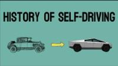

---

## Page 40

Norwegian University of Life Sciences
39
Robotic Evolution –
DARPA Grand Challenges and Self-driving cars

### Images

#### Image 1 (Page 40)
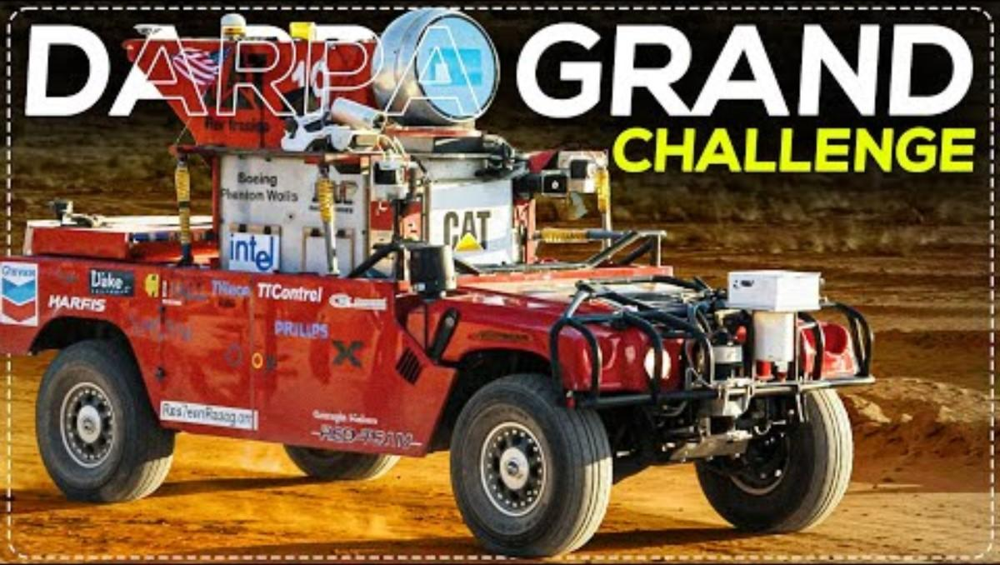

---

## Page 41

• Field- and service robots face specific 
and significant challenges
– Complex, cluttered and changing 
environment
– Risk of harm and safety 
– Sensors and perception
– Actuation and manipulation
Norwegian University of Life Sciences
40
Grand challenges of robotics

### Images

#### Image 1 (Page 41)
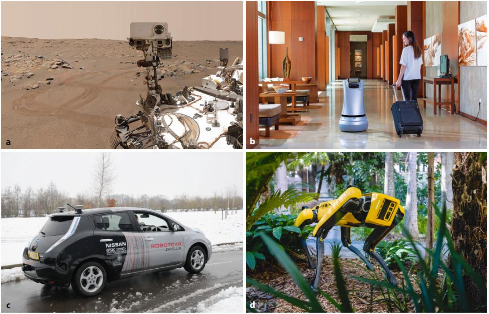

---

## Page 42

Fundamental questions in Robotics
• Where should I go? What to do there?
– Task planning
• Where am I? 
– Localization
• What is the surrounding environment?
– Mapping
• How do I move safely from A to B?
– Motion planning
Norwegian University of Life Sciences
41
Robot 
Navigation

### Images

#### Image 1 (Page 42)

---

## Page 43

Robot Navigation
• «the process of directing a vehicle so 
as to reach the intended destination”
– IEEE Standard 172-1983
Norwegian University of Life Sciences
42
Localization
Mapping
Motion 
planning
SLAM
Integrated
Navigation
Approach
Exploration
Active 
Localization

---

## Page 44

System Overview
43
Multi-Agent Mission Planning
Multi-Agent Task Planning & Assignment
Strategic objectives 
& constraints
Tactical objectives & constraints
Icons from www.flaticon.com
Tasks & constraints
Sensors & 
Perception
Sensors & 
Perception
Sensor readings, observations, maps

### Images

#### Image 1 (Page 44)
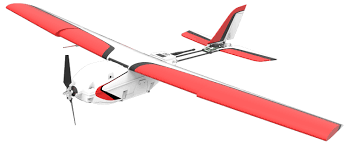

#### Image 2 (Page 44)
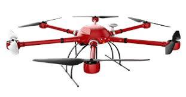

#### Image 3 (Page 44)

#### Image 4 (Page 44)
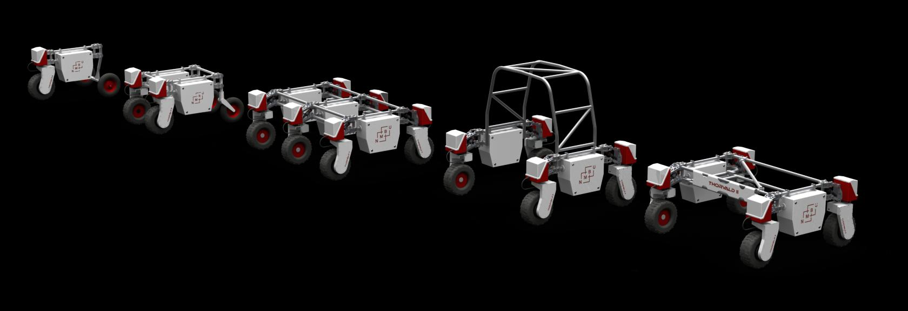

---

## Page 45

Motion Planning
System overview
Norwegian University of Life Sciences
44
Path- and Trajectory Planning
Motion Control
Task Planner
Localization & Mapping
Sensors & Perception

### Images

#### Image 1 (Page 45)

#### Image 2 (Page 45)

---

## Page 46

• Course content contd.
– Mobile robots, Ch. 4
– Navigation, Ch. 5
– Localization and mapping,  Ch. 6
• Course material
– RVC 3rd Ed. + QUT Robot Academy 
+ lecture notes + files on Canvas
• Course content
– Coordinate systems, Ch2.
– Time and motion, Ch3.
– Robot programming (RS/Python)
– Sensors, perception, vision & robot 
learning
– Manipulator- and differential 
kinematics, Ch. 7-8
Norwegian University of Life Sciences
45
TEL200 Introduction to Robotics

### Images

#### Image 1 (Page 46)

---

## Page 47

Norwegian University of Life Sciences
46
List and discuss some ethical issues within robotics!
How should these be handled?

### Images

#### Image 1 (Page 47)
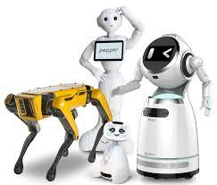

#### Image 2 (Page 47)

#### Image 3 (Page 47)

#### Image 4 (Page 47)

#### Image 5 (Page 47)

#### Image 6 (Page 47)

#### Image 7 (Page 47)

#### Image 8 (Page 47)
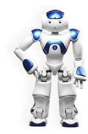

#### Image 9 (Page 47)

#### Image 10 (Page 47)

#### Image 11 (Page 47)
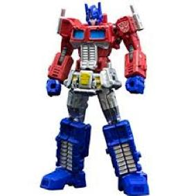

#### Image 12 (Page 47)
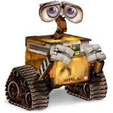

---

## Page 48

Norwegian University of Life Sciences
47
State of the art: Waymo

### Images

#### Image 1 (Page 48)
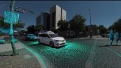

---

## Page 49

Norwegian University of Life Sciences
48
Robotic Evolution – Boston Dynamics 40 yrs (Hyuandai)

### Images

#### Image 1 (Page 49)
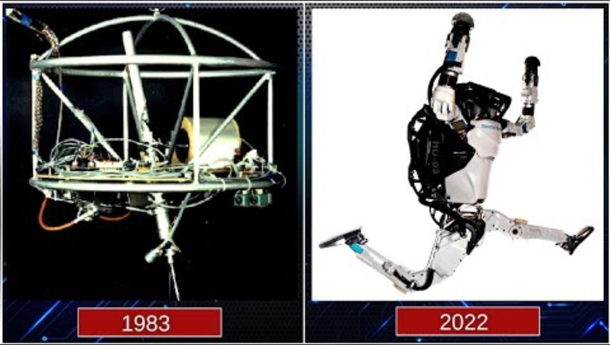

---

## Page 50

Norwegian University of Life Sciences
49
State of the art: DARPA Triage Challenge 2026
$$
https://youtu.be/_EZQx87DyzM?feature=shared
$$
https://triagechallenge.darpa.mil

### Images

#### Image 1 (Page 50)
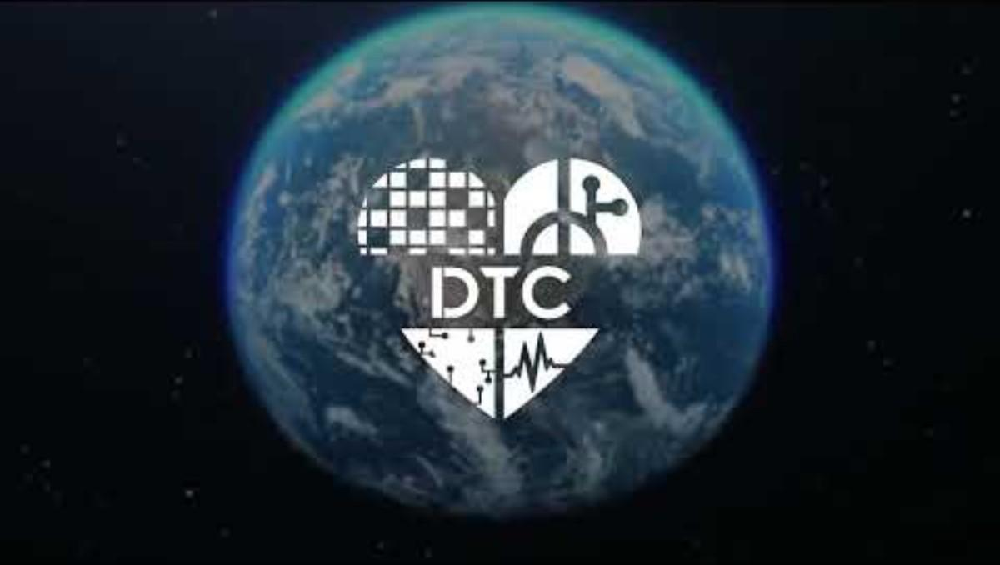

---

## Page 51

Thank you for your attention!

---
